# migraciones

Las Migraciones se les conoce como el control de versiones de tu base de datos; de esta forma se puede crear la base de datos y compartir el diseño con el equipo de trabajo.

Si deseas agregar nuevas tablas o columnas a una tabla existente, puedes hacerlo con una nueva migración; si el resultado no fue el deseado, puedes revertir esa migración.

Lanzar desde comandos:

```php
// ejecuta las migraciones
sudo docker-compose exec myapp php artisan migrate

// en caso de querer deshacer el cambio:    
sudo docker-compose exec myapp php artisan migrate:rollback
// regresar las últimas 5 (por ejemplo) migraciones  
sudo docker-compose exec myapp php artisan migrate:rollback --step=5

// otros comandos para crear migración    
sail artisan make:migration agregar_imagen_user
// o
sail php artisan make:migration agregar_imagen_user
```

Las migraciones se van a ir colocando, siempre, en la carpeta del proyecto `database/migrations`:

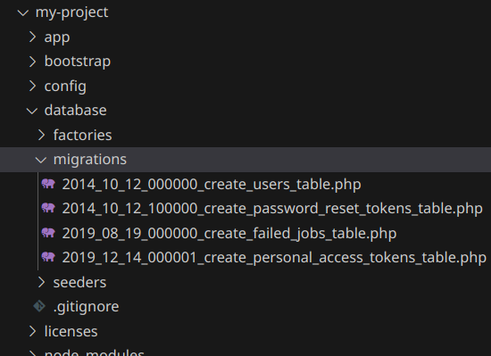

Laravel tiene unas migraciones por defecto, sobre todo para la creación de usuarios.

> Consideraciones previas:
>
> Recuerda tener el fichero `.env` configurado para acceder a tu bd en qüestión y con usuario y contraseña adecuados:
>
> 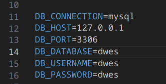

Abrimos el terminal, dentro del proyecto:

```sh
sudo docker-compose exec myapp php artisan migrate
```

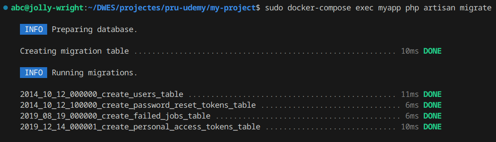

Si, después de ejecutar, accedemos a nuestra base de datos (por ejemplo desde phpMyadmin):

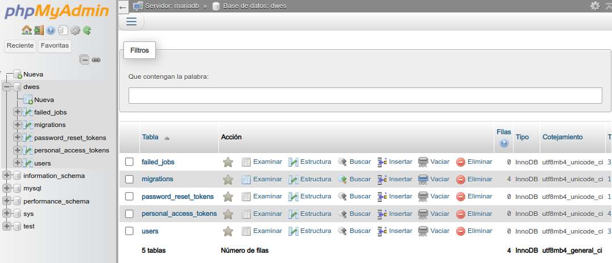

Si, quisiéramos echar para atrás en la migración:

```sh
sudo docker-compose exec myapp php artisan migrate:rollback
```

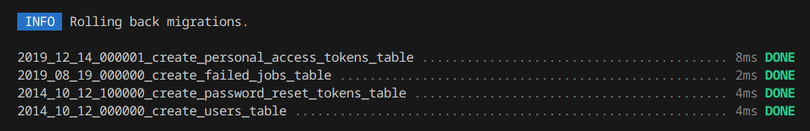

Vemos que las tablas dejan de existir (solo queda la tabla migraciones) en nuestra bd:

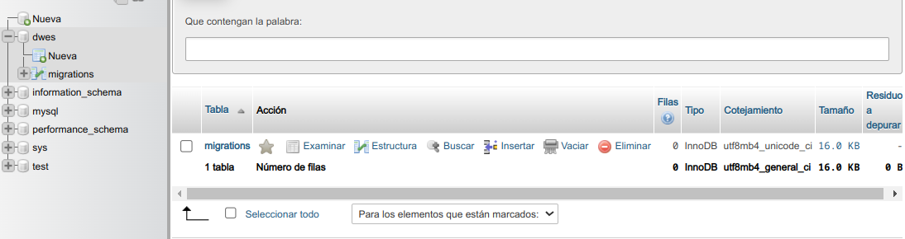


## siguiendo el ejemplo de crear usuario en la app

Como vemos, si intentamos crear un usuario en nuestro ejemplo de inserción de usuarios, se obtiene un error en el que nos indica que falta el campo `username` en la tabla `users`. Esto es debido a que, cuando se ha ejecutado, por primera vez, la migración este campo no existía. Para que la app funcione deberemos de migrar este campo.

Ejecutamos:

```sh
sudo docker-compose exec myapp php artisan make:migration add_username_to_users_table
```

Si accedemos al fichero generado en la carpeta `migrations` insertaremos el código que se muestra a continuación:

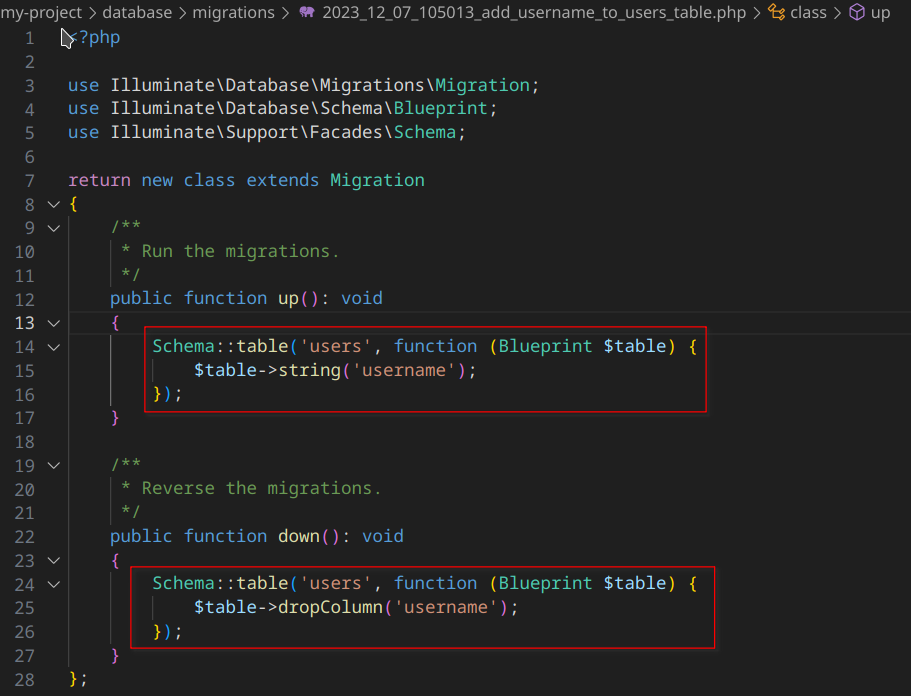

Para que los cambios surjan efecto, volvemos a ejecutar `migrate`:

```sh
sudo docker-compose exec myapp php artisan migrate
```

# modelos

## ORM Eloquent

Laravel incluye su propio **ORM** (Object Relacional Mapper) que hace muy sencillo interactuar con tu base de datos.

En **Eloquent** cada tabla, tiene su propio modelo; ese modelo interactúa únicamente con esa tabla y tiene las funciones necesarias para crear registros, obtenerlos, actualizarlos y eliminarlas.

```sh
sudo docker-compose exec myapp php artisan make:model Cliente
```

## convenciones en Laravel

### en Modelos

Cuando creas el Modelo Cliente, Eloquent asume que la tabla se va a llamar **clientes**.

Si el Modelo se llama Producto; Eloquent espera una tabla llamada **productos**.

Puede ser un problema llamar tu modelo Proveedor, porque Eloquent espera la tabla llamada **provedors**, pero se puede reescribir en el modelo.

## crear registros con Eloquent ORM

Para insertar una fila en nuestra tabla `users`, debemos insertar el siguiente código en nuestro controlador `RegisterController.php`:

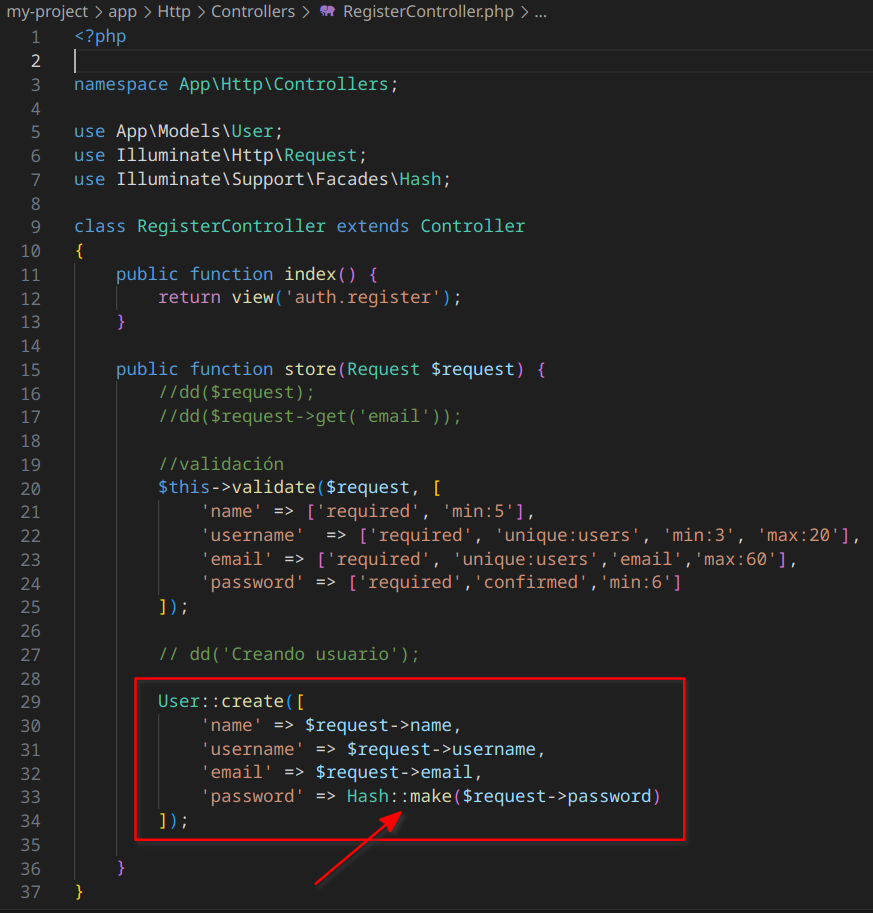

A tener en cuenta:

1. cuando introducimos `User`arriba del código se va a importar `use App\Models\User;`

2. el método `create` corresponde a un `insert into ...`

3. podemos utilizar un helper (en Laravel encontramos una gran variedad) relacionado con los string; por ejemplo para que no introduzcamos espacios no deseados en el campo username.

4. vemos que, para *hashear* el password y que no se vea la cadena literal, podemos utilizar la clase `Hash::make(cadena)`. Si no importa directamente `use Illuminate\Support\Facades\Hash` le damos *botón derecho*-**import class**.

   > **cuidado**
   >
   > Si no modificamos nada más, el campo `username` obtendrá un error. Esto es debido a que este campo lo hemos introducido nosotros después de la primera migración; y Laravel tiene un sistema de seguridad por el que no permite creaciones de campo tan fácilmente (así prevee posibles ataques de inserción de código en nuestra base de datos).

5. Para ello, además del código anterior, modificaremos el modelo `User.php` que se encuentra en la carpeta `app/Models` como medida de seguridad:

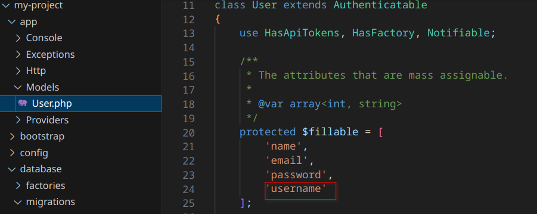

4. Probamos insertar un usuario en la app:

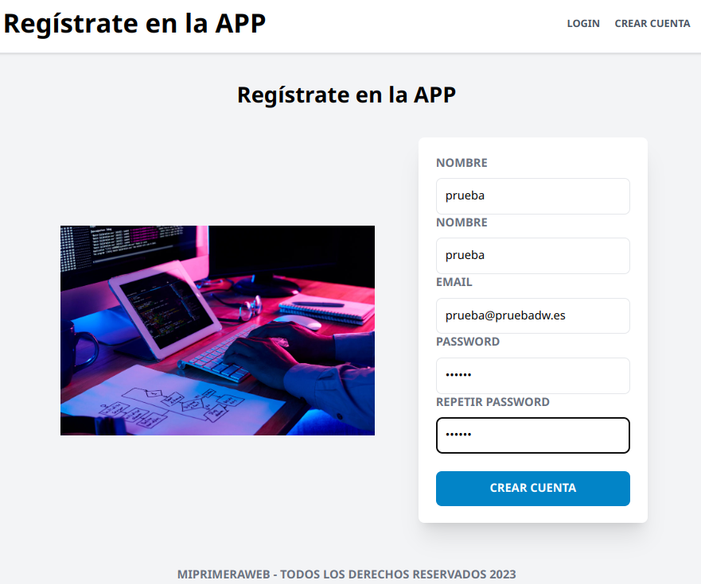

​	Y vemos que se ha insertado en la base de datos:

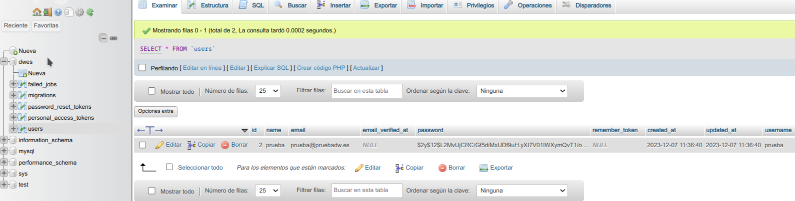

### cambiar el campo 'username' a único

Echar para atrás la última migración:

```sh
sudo docker-compose exec myapp php artisan migrate:rollback
```

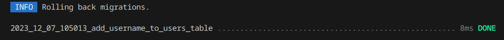

Hacer cambios en el fichero `...add_username_to_users_table.php`:

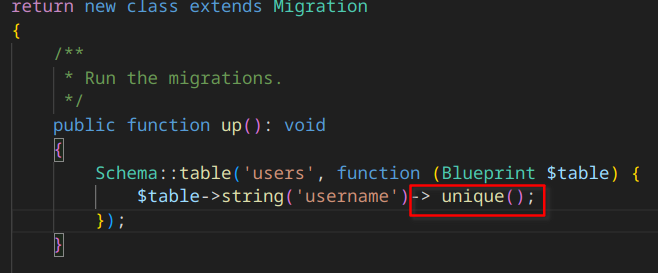

Volver a migrar:

```sh
sudo docker-compose exec myapp php artisan migrate
```

Ahora podemos hacer un cambio en `RegisterController.php`:

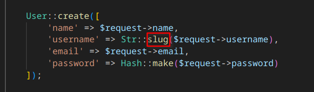

Insertamos un valor en `username`con mayúsculas y espacios:

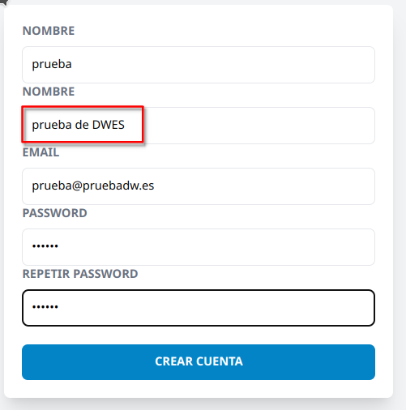

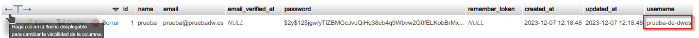

Para que no aparezca un mensaje de error al introducir dos usuarios con el `username` iguales, lo que podemos hacer es modificar el Request (cuando es nuestra última opción) 

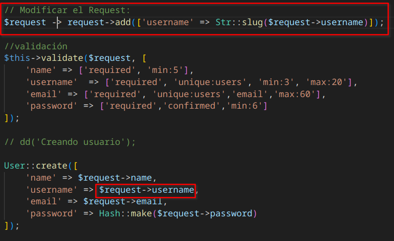

## redireccionar al usuario al Muro una vez su cuenta es creada

1. Crear un controlador de nombre `PostController`:

```sh
sudo docker-compose exec myapp php artisan make:controller PostController
```

2. Crear un controlador de nombre `LoginController`:

```sh
sudo docker-compose exec myapp php artisan make:controller LoginController
```

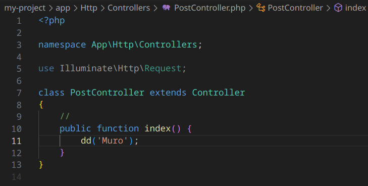

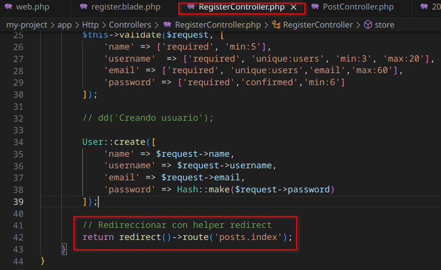

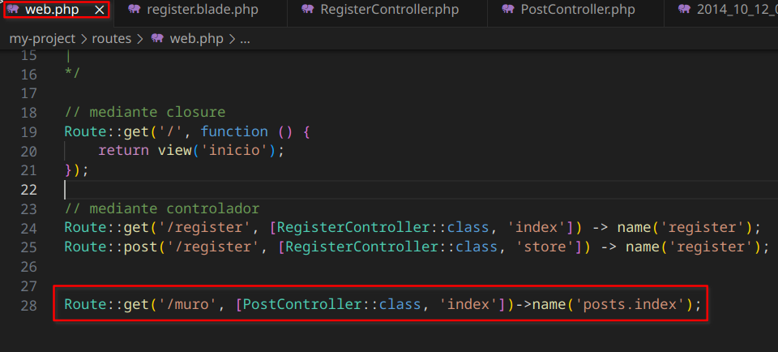

## autenticar un usuario que ha creado su cuenta


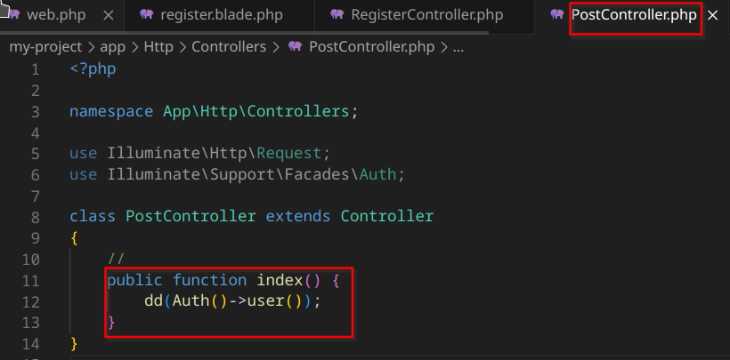


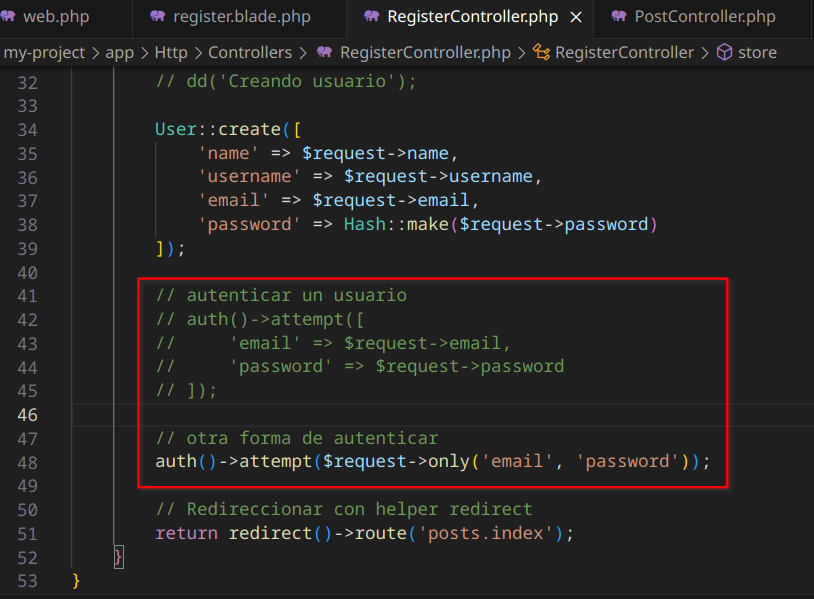