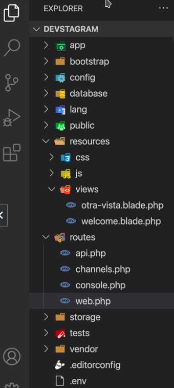

[TOC]

# duración y criterios de evaluación

**Duración estimada**: ∞ sesiones.

------

**Resultado de aprendizaje y criterios de evaluación**:

4. Desarrolla aplicaciones Web embebidas en lenguajes de marcas analizando e incorporando funcionalidades según especificaciones.

   a) *Se han identificado los mecanismos disponibles para el mantenimiento de la información que concierne a un cliente web concreto y se han señalado sus ventajas.*

   b) *Se han utilizado sesiones para mantener el estado de las aplicaciones Web.*

   c) *Se han utilizado cookies para almacenar información en el cliente Web y para recuperar su contenido.*

   d) *Se han identificado y caracterizado los mecanismos disponibles para la autentificación de usuarios.*

   e) *Se han escrito aplicaciones que integren mecanismos de autentificación de usuarios.*

   f) *Se han realizado adaptaciones a aplicaciones Web existentes como gestores de contenidos u otras.*

   g) *Se han utilizado herramientas y entornos para facilitar la programación, prueba y depuración del código.*

---

# consideraciones previas

## MVC

**MVC** (Model View Controller o Modelo Vista Controlador) es un patrón de arquitectura de software que permite la separación de obligaciones de cada pieza de tu código. 

Este paradigma de la programación enfatiza la separación de la lógica de programación con la presentación.

**Ventajas**:

- MVC no mejora el performance del código, tampoco da seguridad; pero **tu código tendrá un mejor orden y será fácil de mantener**.
- En un grupo de trabajo, el tener el código ordenado permite que más de una persona pueda entender que es lo que hace cada parte de él.
- Aprender MVC, te hará que otras tecnologías como *Nest*, *Rails*, *Django*, *Net Core*, *Spring Boot* te serán más sencillas de aprender.

### Modelo

Encargado de todas las interacciones en la base de datos (obtener datos, actualizarlos y eliminar). 

El Modelo se encarga de consultar una base de datos, obtiene la información pero no la muestra (esa tarea es para las vistas).

El Modelo tampoco se encarga de actualizar la información directamente (esa tarea es del Controlador, que es quien decide cuándo llamarlo).

### Vista

Se encarga de todo lo que se ve en pantalla (HTML).

Laravel tiene un Template Engine llamado **Blade** para mostrar los datos.

Si utilizas *React*, *Vue*, *Angular*, *Svelte* , etc. estos serían tu vista.

El Modelo consulta la base de datos, pero es por medio del Controlador que se decide qué Vista hay que llamar y qué datos presentar.

### Controlador

Es el que comunica *Modelo* y *Vista*; antes de que el *Modelo* consulte la base de datos el *Controlador* es el encargado de llamar un *Modelo* en específico.

Una vez consultado el *Modelo*, el *Controlador* recibe esa información, manda llamar a la *Vista* y le pasa la información.

El *Controlador* es el que mandar llamar la *Vista* y *Modelo*s, que se requieren en cada parte de tu aplicación.

### Router

Es el encargado de registrar todas las URL’s o Endpoints que va a soportar nuestra aplicación.

Ejemplo: 

Si el Usuario accede a /productos el router ya tiene registrada esa ruta y un controlador con una función que sabe que Modelo debe llamar y que vista mostrar cuando el usuario visita esa URL.


## Artisan

Artisan es el CLI (Command Line Interface) incluido en Laravel.

Artisan es un script que existe en la base de tu proyecto de Laravel y cuenta con una gran cantidad de scripts disponibles.

Estos comandos te permiten crear *migraciones*, *controladores*, *modelos*, *policies* y mucho más.

Todos los comando podemos encontrarlos ejecutando:

```sh
# php artisan
# ó
sudo docker-compose exec myapp php artisan
```

Por ejemplo, si quisiéramos crear un controlador (como veremos más adelante) la orden sería:

```sh
# php artisan make:controller RegisterController
# ó
sudo docker-compose exec myapp php artisan make:controller RegisterController
```

# instalar docker bitnami/Laravel

1. Lo primero de todo es crear una carpeta con el nombre del proyecto que vayamos a crear y nos metemos en ella.

   Por ejemplo, creamos el proyecto myapp-laravel dentro de nuestra carpeta de proyectos del módulo:

   ```sh
   $ mkdir ~/dwes/proyectos/myapp-laravel
   ```

2. Accedemos dentro de la carpeta de este nuevo proyecto.

3. En este punto tenemos dos opciones:

   A. Utilizar la imagen de Bitnami ya preparada, así que lo que hacer ahora es [descargar el archivo docker-compose.yml](https://hub.docker.com/r/bitnami/laravel) del repositorio de Github oficial.

   ```sh
   curl -LO https://raw.githubusercontent.com/bitnami/containers/main/bitnami/laravel/docker-compose.yml
   ```

   B. Utilizar el fichero `docker-compose.yml` que tenemos en nuestra carpeta del curso (en el que se añade el contenedor para *phpMyadmin*).

   > En caso ejecutaremos la opción B.

4. Una vez descargado el archivo en nuestra carpeta que acabamos de crear con el nombre del proyecto, lanzamos el siguiente comando por consola para instalar todas las dependencias y crear las imágenes de Docker correspondientes.

   ```sh
   sudo docker-compose up -d
   ```

5. Si utilizamos el contenedor `Portainer` para la gestión de nuestros contenedores, podremos observar que estarán en marcha nuestros dos contenedores (pertenecientes al servidor web y servidor de bases de datos):


> Si por alguna extraña razón estás en Windows y no te funciona una de las 2 imágenes, puede ser debido a la instalación de composer dentro de la imagen de Laravel.
>
> 
>
> Para solucionarlo, nos vamos a la carpeta del proyecto que se te habrá creado por defecto al hacer docker-compose; en este caso, y si no has modificado el archivo .yml, la carpeta del proyecto sera `my-proyect` y dentro de ella eliminamos la carpeta vendor.
>
> Acto seguido instalar Composer de manera global en nuestro sistema Windows (bájate el instalador [desde este enlace](http://localhost:51235/UD07_ES/resources/Composer-Setup.exe)).
>
> Una vez lo instales ya serás capaz de lanzar el comando composer desde cualquier consola de Windows.

## VSCode extensiones

Recomendable instalar los siguientes plugins para Visual Studio Code.

Referentes a PHP:

- *PHP Intelephense*
- PHP IntelliSense
- *PHP Namespace Resolver*

Referentes a Laravel:

- Laravel Blade Snippets
- *Laravel Snippets*
- Laravel goto view
- *Laravel Extra Intellisense*

Referentes a CSS:

- *Tailwind CSS IntelliSense*

> **Aporte**
>
> Un aporte, o instalación, a tener en cuenta, podría ser la de instalar `Tailwind CSS`. Este software nos va a proporcionar, de manera sencilla y cómoda, una opción de utilizar CSS.
>
> Para ello, seguir las instrucciones del [anexo I - instalación de Tailwind CSS](# anexo I - instalación de Tailwind CSS).

# carpetas en Laravel

Al crear un nuevo proyecto con este framework, Laravel crea una serie de carpetas por defecto. Esta estructura de carpetas es la recomendada para utilizar Laravel.



## app/Http/Controllers

En esta carpeta es donde se van a introducir nuestros controladores (cuando se cree un controlador, es aquí donde va a ubicarse).

## Models

Para seguir el paradigma de **M**VC, los modelos van a introducirse en esta carpeta.

## public

Esta es la carpeta más importante ya que es donde se ponen todos los archivos que el cliente va a mostrar al usuario cuando introduzcamos la URL de nuestro sitio web (por ejemplo, dentro de esta carpeta crear otra carpeta `img`). Normalmente se carga el archivo `index.php` por defecto.

## resources

Esta es nuestra carpeta de recursos donde guardaremos los siguientes archivos, que también, están separados por sus carpetas... como cada nombre indica:

- `css` Archivos CSS (archivos originales que son procesadas y se colocan las versiones compiladas en `public` mediante al archivo `webpack.mix.js`).
- `js` Archivos JS o JavaScript (archivos originales que son procesadas y se colocan las versiones compiladas en `public` mediante al archivo `webpack.mix.js`).
- `lang` Archivos relacionados con el idioma del sitio (variables & strings).
- `views` Archivos de nuestras vistas, lo que las rutas cargan (comúnmente: lo que se ve en pantalla).

Podemos observar todo esto en el  [ejemplo 01](# ejemplo 01. Hola mundo).

## routes

Otra de las carpetas que más vamos a usar a lo largo de esta unidad dedicada a Laravel es `routes`. En ella se albergan todas las **rutas** (redirecciones web) de nuestro proyecto, pero más concretamente en el archivo `web.php`:

```sh
Dada una ruta → se cargará una vista
```

## vendor

En esta carpeta se colocan todas las dependencias de `Composer` que son necesarias tanto para que Laravel funcione o si quieres agregar alguna dependencia extra (por ejemplo: agregar pagos con *Paypal* . Laravel tiene un paquete llamado cashier que permite pagos en línea y también podemos instalar una dependencia extra mediante Composer).

Podemos observar en el archivo `composer.json` las dependencias instaladas.

##  .env

Aunque `.env` no es una carpeta, sino un archivo, también merece especial atención por ser un fichero de configuración de nuestro proyecto. Por ejemplo la conexión a base de datos:

```sh
# ...
DB_CONNECTION=mysql
DB_HOST=127.0.0.1
DB_PORT=3306
DB_DATABASE=dwes
DB_USERNAME=dwes
DB_PASSWORD=dwes
# ...
```

# rutas

Las rutas en Laravel (y en casi cualquier Framework) sirven para redireccionar al cliente (o navegador) a las vistas que nosotros queramos.

Estas rutas se configuran en el archivo `routes/web.php` donde se define la ruta que el usuario pone en la URL después del dominio y se retorna la vista que se quiere cargar al introducir dicha dirección en el navegador. 

En este ejemplo podemos obersvar la clase `Route` y un método estático `get`, este método estático toma la URL ('/' en este caso) y también un *closure* o *callback* ` function () ...`

```php
<?php
	// Ruta por defecto para cargar la vista welcome (sin extensión .blade.php) cuando el usuario introduce simplemente el dominio
	Route::get('/', function () {
		return view('welcome');
	});
```

En el ejemplo de arriba vamos a cargar la vista llamada *welcome* que hace referencia a la vista `resources/views/welcome.blade.php`.

> **closure *VS* controlador**
>
> Se puede definir en el segundo parámetro un closure o un controlador (vermos más adelante este caso).
>
> Por ejemplo:
>
> ```php
> Route::get('/register', [RegisterController::class, 'index']) -> name('register');
> ```
>
> 

## alias

Es interesante darle un alias o un nombre a nuestras rutas para poder utilizar dichos alias en nuestras plantillas de Laravel que veremos más adelante.

Para ello, basta con utilizar la palabra `name` al final de la estructura de la ruta y darle un nombre que queramos; normalmente descriptivo y asociado a la vista que tiene que cargar el enroutador de Laravel.

```php
<?php
	Route::get('/users', function () {
		return view('users');
	}) -> name('usuarios');
```

Después veremos que es muy útil ya que a la hora de refactorizar o hacer un cambio, si tenemos enlaces o menús de navegación que apuntan a esta ruta, sólo tendríamos que cambiar el parámetro dentro del get() y no tener que ir archivo por archivo.

Laravel nos proporciona una manera más cómoda a la hora de cargar una vista si no queremos parámetros ni condiciones. Tan sólo definiremos la siguiente línea que hace referencia la ruta datos en la URL y va a cargar el archivo `usuarios.php` de nuestra carpeta views como le hemos indicado en el segundo parámetro.

```php
<?php
	/* http://localhost/datos/ */
	Route::view('datos', 'usuarios');
```

Pero no sólo podemos retornar una vista, sino, desde un simple string, a módulos propios de Laravel.

Podemos observar todo esto en el  [ejemplo 02](# ejemplo 02. Otras vistas).

## parámetros

Ya hemos visto que con PHP podemos pasar parámetros a través de la URL, como si fueran variables, que las recuperábamos a través del método GET o POST.

Con Laravel también podemos introducir parámetros pero de una forma más vistosa y ordenada, de tal manera que sea visualmente más cómodo de recordar y de indexar por los motores de búsqueda como Google.

```processing
http://localhost/cliente/324
```

Para configurar este tipo de rutas en nuestro archivo de rutas `public/routes/web.php` haremos lo siguiente.

```php
<?php
	Route::get('cliente/{id}', function($id) {
		return('Cliente con el id: ' . $id);
	});
```

¿Qué pasa si no introducimos un id y sólo navegamos hasta cliente/ ? ... Nos va a devolver un `404 | NOT FOUND`.

Para resolver esto, podemos definir una ruta por defecto en caso de que el id (o parámetro) no sea pasado. Para ello usaremos el símbolo `?` en nuestro nombre de ruta e inicializaremos la variable con el valor que queramos.

```php
<?php
	Route::get('cliente/{id?}', function($id = 1) {
		return ('Cliente con el id: ' . $id);
	});
```

Ahora tenemos otro problema, porque estamos filtrando por id del cliente que, normalmente es un número; pero si metemos un parámetro que no sea un número, vamos a obtener un resultado no deseado.

Para resolver este caso haremos uso de la cláusula where junto con una expresión regular númerica.

```php
<?php
	Route::get('cliente/{id?}', function($id = 1) {
		return ('Cliente con el id: ' . $id);
	}) -> where('id', '[0-9]+');
```

Además, podemos pasarle variables a nuestra URL para luego utilzarlas en nuestros archivos de plantillas o en archivos .php haciendo uso de un array asociativo. Veamos un ejemplo con la forma reducida para ahorrarnos código.

```php
<?php
	Route::view('datos', 'usuarios', ['id' => 5446]);
```

... y el archivo `resources/views/usuarios.php` debe tener algo parecido a ésto:

```php
<!-- Estructura típica de un archivo HTML5 -->
<!-- ... -->
<p>Usuario con id: <?= $id ?></p>
<!-- ... -->
```

> Con las plantillas de Laravel **blade.php** veremos cómo simplificar aún más nuestro código.

Para más información acerca de las rutas, parámetros y expresiones regulares en las rutas puedes echar un vistazo a la [documentación oficial de rutas](https://laravel.com/docs/8.x/routing#route-parameters) que contiene numerosos ejemplos.

# plantillas o templates

A través de las plantillas de Laravel vamos a escribir **menos código** PHP y vamos a tener nuestros archivos **mejor organizados**.

**Blade** es el sistema de plantillas que trae Laravel, por eso los archivos de plantillas que guardamos en el directorio de *views* llevan la extensión `blade.php`.

De esta manera sabemos inmediatamente que se trata de una plantilla de Laravel y que forma parte de una vista que se mostrará en el navegador.

## directivas

Laravel tiene un gran número de directivas que podemos utilizar para ahorrarnos mucho código repetitivo entre otras funciones.

Digamos que las directivas son pequeñas funciones ya escritas que aceptan parámetros y que cada una de ellas hace una función diferente dentro de Laravel.

- `@yield` define el contenido dinámico que se va a cargar. Se usa conjuntamente con `@section`.
- `@section` y `@endsection` bloque de código dinámico.
- `@extends` importa el contenido de una plantilla ya creada.

## separando código

Veamos sobre un ejemplo cómo separar el código para no repetirlo.

Podemos observar todo esto en el  [ejemplo 03](# ejemplo 03. Uso de directivas).

Realiza también el  [ejemplo 04](# ejemplo 04. Vista registrarse).

## estructuras de control

Como en todo buen lenguaje de programación, en Laravel también tenemos estructuras de control.

En Blade (plantillas de Laravel) siempre que iniciemos un bloque de estructura de control **DEBEMOS** cerrarla.

- `@foreach` ~ `@endforeach` lo usamos para recorrer arrays.
- `@if` ~ `@endif` para comprobar condiciones lógicas.
- `@switch` ~ `@endswitch` en función del valor de una variable ejecutar un código.
- `@case` define la casuística del switch.
- `@break` rompe la ejecución del código en curso.
- `@default` si ninguna casuística se cumple.

```php
<?php
  $equipo = ['María', 'Alfredo', 'William', 'Verónica'];

  @foreach ($equipo as $elemento)
     <p> {{ $elemento }} </p>
  @endforeach
```

Acordaros que podemos pasar variables a través de las rutas como si fueran parámetros. Pero en este caso, vamos a ver otra directiva más; el uso de `@compact`.

```php
<?php
  // Uso de @compact
  $equipo = ['María', 'Alfredo', 'William', 'Verónica'];

  // Route::view('nosotros', ['equipo' => 'equipo']);
  Route::view('nosotros', @compact('equipo'));
```

# controladores

Los controladores son el lugar perfecto para definir la **lógica de negocio** de nuestra aplicación o sitio web.

Hace de intermediario entre la *Vista* (lo que vemos con nuestro navegador o cliente) y el servidor donde la app está alojada.

Por defecto, los controladores se guardan en una carpeta específica situada en `app/Http/Controllers` y tienen extensión `.php`.

Para crear un controlador nuevo debemos hacer uso de nuestro querido CLI *artisan* donde le diremos que cree un controlador con el nombre que nosotros queramos.

Abrimos la consola y nos situamos en la raíz de nuestro proyecto:

```sh
php artisan make:controller PagesController
```

> **ABC**
>
> Si no podemos ejecutar la sentencia anterior, entonces:
>
> ```sh
> sudo docker-compose exec myapp php artisan make:controller PagesController
> ```
>
> 

Si todo ha salido bien, recibiremos un mensaje por consola con que todo ha ido bien y podremos comprobar que, efectivamente se ha creado el archivo `PagesController.php` con una estructura básica de controlador, dentro de la carpeta `Controllers` que hemos descrito anteriormente. 

Ahora podemos modificar nuestro archivo de rutas `web.pbp` para dejarlo limpio de lógica y trasladar ésta a nuestro nuevo controlador.

La idea de ésto es dejar el archivo `web.php` tan limpio como podamos para que, de un vistazo, se entienda todo perfectamente.

> **recuerda** 
>
> sólo movemos la lógica, mientras que las cláusulas como `where` y `name` las seguimos dejando en el archivo de rutas `web.php`.

## convenciones

Laravel tiene una convención a la hora de nombrar los métodos de tus controllers conocida como Resource Controllers.

Esta convención ayuda bastante para tener todo mejor organizado:

| verbo HTTP |         URI         | acción  | ruta             |
| :--------: | :-----------------: | ------- | ---------------- |
|    GET     |      /clientes      | index   | clientes.index   |
|    POST    |      /clientes      | store   | clientes.store   |
|   DELETE   | /clientes/{cliente} | destroy | clientes.destroy |

En este enlace a la documentación de Laravel vemos las acciones que son controladas (o manejadas) por el controlador [enlace](https://laravel.com/docs/10.x/controllers#actions-handled-by-resource-controller).


Veamos cómo quedaría un refactor del archivo de rutas utilizando un Controller como el que acabamos de crear.

Ahora nos quedaría de la siguiente manera:

```php
<?php

  // web.php (v2.0) ▒▒▒▒ Refactorizado

  use App\Http\Controllers\PagesController;
  use Illuminate\Support\Facades\Route;

  Route::get('/', [ PagesController::class, 'inicio' ]);
  Route::get('datos', [ PagesController::class, 'datos' ]);
  Route::get('cliente/{id?}', [ PagesController::class, 'cliente' ]) -> where('id', '[0-9]+');
  Route::get('nosotros/{nosotros?}', [ PagesController::class, 'nosotros']) -> name('nosotros');
```

y en nuestro archivo controlador lo dejaríamos de la siguiente manera:

```php
<?php
  // PagesController.php

  namespace App\Http\Controllers;

  class PagesController extends Controller
  {
     public function inicio() { return view('welcome'); }

     public function datos() { 
        return view('usuarios', ['id' => 56]);
     }

     public function cliente($id = 1) {
        return ('Cliente con el id: ' . $id);
     }

     public function nosotros($nombre = null) {
        $equipo = [
            'Paco',
            'Enrique',
            'Maria',
            'Veronica'
        ];

        return view('nosotros', @compact('equipo', 'nombre'));
     }
  }
```

Podemos observar todo esto en el  [ejemplo 05](# ejemplo 05. controlador RegisterController y su formulario).

# tipos de Request

## En HTTP y API’s

En HTTP existen diferentes tipos de Request o tipos de Petición: GET, POST, PUT, PATCH y DELETE. 

- `GET` es el más simple; cuando visitas un sitio web por default es un GET, y el método solo se utiliza para recuperar datos pero nunca debe enviar datos. 
- `POST` se utiliza cuando mandas datos a un servidor; esto incluye información que llenas en un formulario o buscador.
- `PUT` es utilizado para actualizar un elemento; pero si no existe crea uno nuevo; PUT es un reemplazo total de un registro.
- `PATCH` es utilizado para actualizar parcialmente un elemento o recurso. 
- `DELETE` se utiliza para eliminar un recurso o elemento.

Podemos observar todo esto en el  [ejemplo 06](# ejemplo 06. petición post).

# validación de formularios

Para validar los campos de un formulario podemos utilizar las reglas de validación; éstas se colocarán en la función `store` del controlador (en este ejemplo `RegisterController.php`):

```php
public function store(Request $request) {
        //dd($request);
        //dd($request->get('email'));

    	//validación
        $this->validate($request, [
            'name' => ['required', 'min:5'],
            'username'  => ['required', 'unique:users', 'min:3', 'max:20'],
            'email' => ['required', 'unique:users','email','max:60'],
            'password' => ['required','confirmed','min:6']
        ]);
```

> **por qué en `unique` se refiere a una tabla `users` que todavía no la hemos creado?**
>
> Más adelante lo veremos, pero se puede obersar en la carpeta `database/migrations` que tenemos una migración de la tabla `users`. Laravel crea automáticamente estas tablas.

Todas las reglas de validación de Laravel podemos observarlas en la documentación oficial, en este [enlace](https://laravel.com/docs/10.x/validation#available-validation-rules).

Podemos observar que, en apariencias, no hace nada (o no muestra nada). Para mostrar un mensaje de error colocaremos la directiva `@error`...`@enderrror` en nuestro formulario (en el ejemplo `register.blade.php`) justo después del `<input>` en cuestión. 

Siguiendo en el ejemplo:

```php+HTML
<input 
        id="name"
        name="name"
        type="text"
        placeholder="tu nombre"
        class="border p-3 w-full rounded-lg"
    >
@error('name')
    <p class="bg-red-500 text-white my-2 rounded-lg text-sm p-2 text-center">
        el nombre es obligatorio
    </p>
@enderror
```

## mostrar errores de forma dinámica

Poniendo este párrafo solo mostraría si el nombre es obligatorio; pero podemos tener más validaciones (en el mismo input) que chequear. Este tipo de errores con texto estático **no es la mejor opción**. Laravel ya tiene una serie de mensajes para dicho caso.  Deberemos imprimir un mensaje con el mensaje de error `$message`:

```php+HTML
@error('username')
<p class="bg-red-500 text-white my-2 rounded-lg text-sm p-2 text-center">
    {{ $message }}
</p>
@enderror
```

## mensajes en castellano

Los mensajes de errores están en inglés, ¿cómo podemos **mostrarlos en castellano**? Existen paquetes en Laravel en castellano, por ejemplo [MarcoGomesr/laravel-validation-en-espanol](https://github.com/MarcoGomesr/laravel-validation-en-espanol). 

Descomprimes el directorio `es` en una carpeta en `resources` llamada `lang` (deberás de crearla).

Para terminar el cambio accede al fichero `config/app.php` y en la linea 86 cambiar el idioma a español:

```php
  'locale' => 'es',
```

## customizar el campo de error

Si queremos pintar de color rojo el campo en el que aparece el error, podemos poner en la clase del input un `@error` que diga que si existe un error en (por ejemplo) el campo username coloree el borde del campo en rojo:

```php
<input 
    id="username"
    name="username"
    type="text"
    placeholder="tu nombre de usuario"
    class="border p-3 w-full rounded-lg
             @error('username') border-red-500 @enderror"
>
```

## mantener el valor en el campo después de un error

Muchas veces es frustrante volver a un formulario después de un error y observar que los valores de todos los campos se han borrado y que necesitas volver a introducirlos. Para evitar este caso podemos poner en los `input` el atributo `value` y pasarle `"{{ old('username') }}"`:

```php
<input 
    id="username"
    name="username"
    type="text"
    placeholder="tu nombre de usuario"
    class="border p-3 w-full rounded-lg
             @error('username') border-red-500 @enderror"
    value= "{{old('username')}}"
>
```

> A partir de ahora, como tarea, puedes validar tu mismo todos los campos del formulario.

Entre la validación de Laravel también podrá verse la validación de HTML5. Si quieres deshabilitar esta última puedes introducir el atributo `novalidate` en la etiqueta `<form ... novalidate>`.

## confirmar password en otro campo

Para confirmar el password notamos que habíamos puesto al campo de confirmación de password esta etiqueta:

```php+HTML
<div>
    <label for="password_confirmation" class="mb-2 block uppercase text-gray-500 font-bold">
        Repetir password
    </label>
    <input 
        id="password_confirmation"
        name="password_confirmation"
        type="password"
        placeholder="repite la contraseña"
        class="border p-3 w-full rounded-lg"
    />
</div>
```

Una convención en Laravel para comprobar si dos campos son iguales es asignarle al segundo el prefijo `_confirmatio`.`password_confirmation`(y **debe nombrarse así**) junto con la validación `confirmed` que hemos puesto para el campo `pasword` en el controlador va a verificar que el campo `passwor` y `password_confirmation` sean iguales.

# migraciones y la base de datos

Si has seguido los ejemplos anteriores correctamente habrás comprobado que cuando ponemos un correo e intentamos acceder muestra el siguiente error:


Nos indica que está revisando el valor de `email` en la tabla de usuarios y esta no existe. Para completar el formulario habrá que crear dicha tabla `users`. Para esto debemos realizar nuestra primera migración.

## qué son migraciones

Las Migraciones se les conoce como el control de versiones de tu base de datos; de esta forma se puede crear la base de datos y compartir el diseño con el equipo de trabajo.

Si deseas agregar nuevas tablas o columnas a una tabla existente, puedes hacerlo con una nueva migración; si el resultado no fue el deseado, puedes revertir esa migración.

Lanzar desde comandos:

```php
// ejecuta las migraciones
sudo docker-compose exec myapp php artisan migrate

// en caso de querer deshacer el cambio:    
sudo docker-compose exec myapp php artisan migrate:rollback
// regresar las últimas 5 (por ejemplo) migraciones  
sudo docker-compose exec myapp php artisan migrate:rollback --step=5

// otros comandos para crear migración    
sail artisan make:migration agregar_imagen_user
// o
sail php artisan make:migration agregar_imagen_user
```

Las migraciones se van a ir colocando, siempre, en la carpeta del proyecto `database/migrations`:


Laravel tiene unas migraciones por defecto, sobre todo para la creación de usuarios.

> **Consideraciones previas**
>
> Recuerda tener el fichero `.env` configurado para acceder a tu bd en qüestión y con usuario y contraseña adecuados:
>
> 

Abrimos el terminal, dentro del proyecto:

```sh
sudo docker-compose exec myapp php artisan migrate
```


Si, después de ejecutar, accedemos a nuestra base de datos (por ejemplo desde phpMyadmin):


### rollback de la migración

Si, quisiéramos echar para atrás en la migración:

```sh
sudo docker-compose exec myapp php artisan migrate:rollback
```


Vemos que las tablas dejan de existir (solo queda la tabla migraciones) en nuestra bd:


## siguiendo el ejemplo de crear usuario en la app

Como vemos, si intentamos crear un usuario en nuestro ejemplo de inserción de usuarios, se obtiene un error en el que nos indica que falta el campo `username` en la tabla `users`. Esto es debido a que, cuando se ha ejecutado, por primera vez, la migración este campo no existía. Para que la app funcione deberemos de migrar este campo.

Ejecutamos (el nombre lleva una convención de Laravel):

```sh
sudo docker-compose exec myapp php artisan make:migration add_username_to_users_table
```

Si accedemos al fichero generado en la carpeta `migrations` insertaremos el código que se muestra a continuación:


Para que los cambios surjan efecto, volvemos a ejecutar `migrate`:

```sh
sudo docker-compose exec myapp php artisan migrate
```

> Aunque se indique el campo `username` como string se creará en la base de datos como varchar.

Siguiendo el ejemplo anterior ahora no nos dará error la inserción en el formulario.

# modelos

## ORM Eloquent

Laravel incluye su propio **ORM** (Object Relacional Mapper) que hace muy sencillo interactuar con tu base de datos.

En **Eloquent** cada tabla tiene su propio modelo; ese modelo interactúa únicamente con esa tabla y tiene las funciones necesarias para crear registros, obtenerlos, actualizarlos y eliminarlas.

```sh
sudo docker-compose exec myapp php artisan make:model Cliente
```

Laravel tiene el modelo `users` creado por defecto.

## convenciones en Laravel

### en Modelos

Cuando creas el Modelo Cliente, Eloquent asume que la tabla se va a llamar **clientes**.

Si el Modelo se llama Producto; Eloquent espera una tabla llamada **productos**.

Puede ser un problema llamar tu modelo Proveedor, porque Eloquent espera la tabla llamada **provedors**, pero se puede reescribir en el modelo.

## crear registros con Eloquent ORM

Para **insertar una fila** en nuestra tabla `users`, debemos insertar el siguiente código en nuestro controlador `RegisterController.php`:


A tener en cuenta:

1. cuando introducimos `User`arriba del código se va a importar `use App\Models\User;`

2. el método `create` corresponde a un `insert into ...`

3. podemos utilizar un helper (en Laravel encontramos una gran variedad) relacionado con los string; por ejemplo para que no introduzcamos espacios no deseados en el campo username.

4. vemos que, para *hashear* el password y que no se vea la cadena literal, podemos utilizar la clase `Hash::make(cadena)`. Si no importa directamente `use Illuminate\Support\Facades\Hash` le damos *botón derecho*-**import class**.

   > **cuidado**
   >
   > Si no modificamos nada más, el campo `username` obtendrá un error. Esto es debido a que este campo lo hemos introducido nosotros después de la primera migración; y Laravel tiene un sistema de seguridad por el que no permite creaciones de campo tan fácilmente (así prevee posibles ataques de inserción de código en nuestra base de datos).

5. Para ello, además del código anterior, modificaremos el modelo `User.php` que se encuentra en la carpeta `app/Models` como medida de seguridad:


4. Probamos insertar un usuario en la app:


​	Y vemos que se ha insertado en la base de datos:


### cambiar el campo 'username' a único

Echar para atrás la última migración:

```sh
sudo docker-compose exec myapp php artisan migrate:rollback
```


Hacer cambios en el fichero `...add_username_to_users_table.php`:


Volver a migrar:

```sh
sudo docker-compose exec myapp php artisan migrate
```

Ahora podemos hacer un cambio en `RegisterController.php`, que convierte la cadena a una URL (minúscula y los espacios los substituye por un guión medio):


Insertamos un valor en `username`con mayúsculas y espacios:


Para que no aparezca un mensaje de error al introducir dos usuarios con el `username` iguales, lo que podemos hacer es modificar el Request (cuando es nuestra última opción):


## redireccionar al usuario al Muro una vez su cuenta es creada

1. Crear un controlador de nombre `PostController`:

```sh
sudo docker-compose exec myapp php artisan make:controller PostController
```

2. Crear un controlador de nombre `LoginController`:

```sh
sudo docker-compose exec myapp php artisan make:controller LoginController
```


## autenticar un usuario que ha creado su cuenta


# anexo I - instalación de Tailwind CSS

Si hemos decidido instalar `Tailwind CSS` para que nos eche una mano con nuestro css, deberemos de seguir estos pasos:

1. Hay que comprobar la versión de npm y node:

   ```sh
   npm -v
   node -v
   ```

2. Si la versión de nodejs es inferior a la versión 14 (a la hora de crear este documento) **antes de seguir habremos de reinstalarlo**. Para ello habrá que ir al [anexo II - reinstalación de node](# anexo II - reinstalación de node) en este mismo documento.

   > **no continuar si la versión de node es inferior a 14**.

3. Si nuestra versión de nodejs es correcta (o hemos procedido a reinstalar node en el punto 2), lo primero será desinstalar bootstrap:

   ```sh
   npm uninstall bootstrap
   ```

4. Instalaremos en desarrollo estas tres dependencias:

   ```sh
   npm install -D tailwindcss postcss autoprefixer
   ```

5. Generamos ahora el fichero `tailwindcss.config.js`que aparecerá en la raíz del proyecto:

   ```sh
   npx tailwindcss init -p
   ```

6. Editar el fichero del proyecto Laravel `tailwindcss.config.js` que se ha generado en el directorio raíz del proyecto y donde indicaremos dónde vamos a utilizarlo:

   ```php
   /** @type {import('tailwindcss').Config} */
   export default {
     content: [
       "./resources/**/*.blade.php",
       "./resources/**/*.js",
       "./resources/**/*.vue",
     ],
     theme: {
       extend: {},
     },
     plugins: [],
   }
   ```

7. Ahora, en el fichero /resources/css/`app.css` agregar las siguientes líneas:

   ```css
   @tailwind base;
   @tailwind components;
   @tailwind utilities;
   ```

8. Desde el terminal (y siempre dentro de nuestro proyecto), vamos a ejecutar:

   ```sh
   npm run dev
   ```

   Si no funciona, prueba:

   ```sh
   npm run dev -- --host
   ```

   

9. En el fichero /resources/views/layouts/`app.blade.php` hay que indicarle que va a utilizar el fichero /resources/css/`app.css`, para ello hay que añadirlo en:

   ```php+HTML
   @vite('resources/css/app.css')
   ```

   

   A partir de ahora, y con este ejemplo, podemos observar que se nos muestra el css:

   

# anexo II - reinstalación de node

Para reinstalar nodejs:

1. Desinstalar node por completo:

   ```sh
   sudo apt-get purge --auto-remove nodejs
   ```

2. Eliminar todo resto de node y npm: 

   ​	a. Antes que nadas, debe ejecutar el siguiente comando desde el terminal:

   ```sh
   sudo rm -rf /usr/local/bin/npm /usr/local/share/man/man1/node* /usr/local/lib/dtrace/node.d ~/.npm ~/.node-gyp /opt/local/bin/node opt/local/include/node /opt/local/lib/node_modules
   ```

   ​	b. Eliminar los directorios node o node_modules de /usr/local/lib con la ayuda del siguiente comando:

   ```sh
   sudo rm -rf /usr/local/lib/node*
   ```

   ​	c. Eliminar los directorios node o node_modules de /usr/local/include con la ayuda del siguiente comando:

   ```sh
   sudo rm -rf /usr/local/include/node*
   ```

   ​	d. Eliminar cualquier archivo de nodo o directorio de /usr/local/bin con la ayuda del siguiente comando:

   ```sh
   sudo rm -rf /usr/local/bin/node
   ```

3. Instalar otra vez nvm:

   ​	a. Instalar NvM (Node Version Manager), desde el directorio de usuario `~` :

   ```sh
   curl -o- https://raw.githubusercontent.com/nvm-sh/nvm/v0.39.0/install.sh | bash
   ```

   ​	b. Actualiza el archivo .bashrc:

   ```sh
   source .bashrc
   ```

   ​	c. Confirma que el directorio local está configurado:

   ```sh
   echo $NVM_DIR
   /home/username/.nvm
   ```

4. Instalar node:

   ​	a. Revisar qué versiones de Node.js están disponibles:

   ```sh
   nvm ls-remote
   ```

   ​	b. Instalar la versión que desees (elige la v20.10.0):

   ```sh
   nvm install v20.10.0
   ```

5. Comprobar que la nueva versión de node es superior a 14:

   ```sh
   node -v
   ```

# ejemplos

## ejemplo 01. Hola Mundo

Vamos a eliminar todo el *style* que viene por defecto y a vaciar de contenido de la etiqueta `<body>` de la vista resources/views/`wellcome.blade.php` y creamos etiqueta:

```php+HTML
<h1>Página principal</h1>
<h2>Hola Mundo.</h2>
```

## ejemplo 02. Otras vistas

Creamos un fichero `nosotros.blade.php`, `tienda.blade.php` en views.

Añadimos en `web.php` :

```php
Route::get('/nosotros', function () {
    return view('nosotros');
});
Route::get('/tienda-virtual', function () {
    return view('tienda');
});
```

## ejemplo 03. Uso de directivas

 Cómo hacer uso del poder de Laravel para crear plantillas y no repetir código.

Supongamos que tenemos ciertas estructuras HTML repetidas como puede ser una cabecera *header*, un menú de navegación *nav* y un par de secciones que hacen uso de este mismo código.

Supongamos que tenemos 3 apartados en la web:

- Inicio
- Blog
- Fotos

1. Primero de todo tendremos que generar un archivo que haga de plantilla de nuestro sitio web.

   Para ello creamos el archivo `app.blade.php` dentro del nuevo directorio de plantillas `resources/views/layouts`.

2. Dicho archivo va a contener el típico código de una página simple de HTML y en el body añadiremos nuestros contenido estático y dinámico.

   ```php+HTML
   <!DOCTYPE html>
   <html lang="{{ str_replace('_', '-', app()->getLocale()) }}">
   <head>
     <meta charset="utf-8">
     <meta name="viewport" content="width=device-width, initial-scale=1">
   
     <title>Mi proyecto - @yield('titulo')</title>
       
     <!-- introducir la siguiente linea para poder utilizar TailwindCSS -->
     @vite('resources/css/app.css')
       
   </head>
       
   <body class="bg-gray-100">
     <header class="p-5 border-b bg-white shadow">
       <div class="container mx-auto flex justify-between items-center">
          <h1 class="text-3xl font-black">
              @yield('titulo')
          </h1>
   
          <nav class="flex gap-5 items-center">
              <a class="font-bold uppercase text-gray-600 text-sm" href="#">Login</a>
              <a class="font-bold uppercase text-gray-600 text-sm"  href="#">Crear cuenta</a>
          </nav>            
       </div>
     </header>
       
     <!-- BORRAR MÁS ADELANTE - este menú de navegación -->
     <nav class="flex gap-5 items-center">
          <a class="font-bold uppercase text-gray-600 text-sm"
             href={{ route('inicio') }} >inicio</a> |
          <a class="font-bold uppercase text-gray-600 text-sm"  
             href={{ route('noticias') }} >blogs</a> |
          <a class="font-bold uppercase text-gray-600 text-sm"  
             href={{ route('fotos') }} >fotos</a>
       </nav>    
       <hr>
       
       <!-- CONTENIDO PRINCIPAL -->
       <main class="container mx-auto mt-10">
          <h2 class="font-black text-center text-3xl mb-10">
              @yield('titulo')
          </h2>
          @yield('contenido')
       </main>    
       
       <!-- FOOTER -->
       <footer class="text-center p-5 text-gray-500 font-bold uppercase">
          MiPrimeraWeb - Todos los derechos reservados @php echo date('Y') @endphp
          <br>
          <!-- con helpers -->
          MiPrimeraWeb - Todos los derechos reservados {{ now()->year}}
       </footer>    
   </body>
   </html>
   ```

   Cada sección que haga uso de esta plantilla contendrá un menú de navegación con enlaces a cada una de las secciones y el contenido dinámico de cada sección.

3. Ahora crearemos los archivos dinámicos de cada una de las secciones, en nuestro caso:

   `inicio.blade.php`:

   Importamos el contenido de plantilla bajo la directiva `@extends` para que cargue los elementos estáticos que hemos declarado y con la directiva `@section` y `@endsection` definimos el bloque de código dinámico, en función de la sección que estemos visitando.

   ```php
   <?php
       // inicio.blade.php
       @extends('layouts.app')
   
       @section('titulo')
           página principal
       @endsection
   
       @section('contenido')
           contenido de la página principal
       @endsection
   ```

   `blog.blade.php`:

   ```php
   <?php
       // blog.blade.php
       @extends('layouts.app')
   
       @section('titulo')
       	notícias
       @endsection
       
       @section('contenido')
           contenido de todas las notícias
       @endsection 
   ```

   `fotos.blade.php`:

   ````php
   <?php
     // fotos.blade.html
     @extends('layouts.app')
   
     @section('titulo')
   	fotografías
     @endsection
       
     @section('contenido')
       galería de fotografías
     @endsection     
   ````

4. El último paso que nos queda es configurar el archivo de rutas `routes/web.php`:

   ````php
   <?php
     // web.php
     Route::view('', 'inicio') -> name('inicio');
     Route::view('blog', 'blog') -> name('noticias');
     Route::view('fotos', 'fotos') -> name('galeria');
   ````

De esta manera podremos hacer uso del menú de navegación que hemos puesto en nuestra plantilla y gracias a los alias noticias y galeria, la URL será más amigable.

## ejemplo 04. Vista registrarse

> Antes de continuar con el ejemplo, debes **eliminar**:
>
> - el menú de navegación de *inicio | blogs | fotos* del fichero `layouts/app.blade.php`.
> - las rutas en el fichero `web.php` que afecten a este menú (exceptuando la ruta de inicio).
> - las dos vistas `blog.blade.php` y `foto.blade.php`.
>
> Este borrado se debe a que NO vamos a continuar con estas vistas; solo eran un ejemplo de uso de directivas y la separación de código. 

Como has observado, nuestro anterior ejemplo contenía en el fichero `resources/views/layouts/app.php` un menú de navegación en el que se indicaba *Login* y *Crear cuenta*.

Crea las vistas para estos dos enlaces. Para ello alojarás sus dos vistas en una carpeta nueva `resources/views/auth` con nombre `register.blade.php` para *Crear cuenta*.

```php
<?php
  // fotos.blade.html
  @extends('layouts.app')

  @section('titulo')
	Regístrate en tu APP
  @endsection
    
  @section('contenido')
    
  @endsection    
```

Añadir al fichero `web.php` la entrada:

```php
  Route::get('/crear-cuenta', function(){
      return view(auth.register) //la ruta contiene .
  }) -> name('resgister');
```

## ejemplo 05. controlador RegisterController y su formulario

En vez de usar *closures* (o *callbacks*) en el fichero `web.php` vamos a crear controladores en nuestro ejemplo y trasladar la lógica de negocio a estos últimos. Así, y siguiendo con los ejemplos anteriores, vamos a crear un controlador para gestionar el registro en nuestra APP (vamos a ordenar nuestros ficheros y colocaremos `RegisterConroller` dentro de la carpeta `Auth` y añadimos doble diagonal inversa `\\`).

Abrimos el CLI artisan (nuevo terminal en VS Code o `Ctrl`+`) en la carpeta de nuestro proyecto y ejecutamos:

````sh
php artisan make:controller Auth\\RegisterController
# ó 
# sudo docker-compose exec myapp php artisan make:controller Auth\\RegisterController
````

En `web.php` modificar la ruta de *Crear cuenta* (quitar el *callback* y añadir el controlador y su método). Se recomienda como convención el nombre del método `index`:

````php
Route::get('/crear-cuenta', [RegisterController::class, 'index']) -> name('resgister');
````

Y en `RegisterController.php`, trasladamos la lógica de negocio que ejecutaba el callback, añadiendo la palabrasreservadas `public` y añadiendo también un nombre a esta función `index()`:

```php
public function index() {
    return view('auth.register');
}
```

Para la vista de register `register.blade.php` vamos a introducir el código:

````php+HTML
@extends('layouts.app')

@section('titulo')
    Regístrate en la APP
@endsection

@section('contenido')
  <div class="md:flex md:justify-center md:gap-10 md:items-center">
    <div class="md:w-6/12 p-5">
      
    </div>

    <div class="md:w-4/12 bg-white p-6 rounded-lg shadow-xl">
      <form action="">
        <div>
          <label for="name" class="mb-2 block uppercase text-gray-500 font-bold">
              Nombre
          </label>
          <input 
              id="name"
              name="name"
              type="text"
              placeholder="tu nombre"
              class="border p-3 w-full rounded-lg"
              />
        </div>
                
        <div>
          <label for="username" class="mb-2 block uppercase text-gray-500 font-bold">
              Nombre
          </label>
          <input 
              id="username"
              name="username"
              type="text"
              placeholder="tu nombre de usuario"
              class="border p-3 w-full rounded-lg"
              />
        </div>

        <div>
          <label for="email" class="mb-2 block uppercase text-gray-500 font-bold">
              Email
          </label>
          <input 
              id="email"
              name="email"
              type="text"
              placeholder="tu email de registro"
              class="border p-3 w-full rounded-lg"
          />
        </div>

        <div>
          <label for="password" class="mb-2 block uppercase text-gray-500 font-bold">
              Password
          </label>
          <input 
              id="password"
              name="password"
              type="password"
              placeholder="tu contraseña de registro"
              class="border p-3 w-full rounded-lg"
          />
        </div>

        <div>
          <!-- password_confirmation para validar posteriormente password -->
          <label for="password_confirmation" class="mb-2 block uppercase text-gray-500 font-bold">
              Repetir password
          </label>
          <input 
              id="password_confirmation"
              name="password_confirmation"
              type="password"
              placeholder="repite la contraseña"
              class="border p-3 w-full rounded-lg"
          />
        </div>
        <br>
        <input 
              type="submit"
              value="Crear cuenta"
              class="bg-sky-600 hover:bg-sky-700 transition-colors 
              cursor-pointer uppercase font-bold w-full p-3 text-white rounded-lg"
        />
      </form>
    </div>
  </div>
@endsection
````

## ejemplo 06. petición post

Vamos a crear ahora el enlace registrarse. Para ello accedemos a `web.php` e introducimos la linea con el método POST:

```php
Route::get('/crear-cuenta', [RegisterController::class, 'index']) -> name('resgister');
Route::post('/crear-cuenta' [RegisterController::class, 'store'])
```

> **No** ponemos un alias en esta ruta porque va a tomar también el alias del anterior ruta.

Al  mismo tiempo, en nuestro controlador `RegisterController.php` agregamos la función `store` :

```php	
public function store() {
        dd('formulario...');
}
```

Para terminar este punto, en el fichero .blade `register.blade.php` vamos a modificar la etiqueta form para que redireccione al action correspondiente con el método en qüestión. Fíjate que en action ponemos la función route y el nombre de la ruta:

```php 
...
<form action="{{route('register')}}" method="POST">   
...
```

Si recargamos la página y accionamos el enlace vemos que nos muestra el siguiente error:


**¿Qué es página expirada?**

Laravel es un framework enfocado a la seguridad (en este caso, se asegura que no suframos ataques del tipo XSRF o Cross Site Request Forgery). Así que Laravel tiene consideraciones de seguridad.

Para evitar estos ataques usaremos la directiva `@csrf` justo después de la linea de la etiqueta <form>.

```php+HTML
...
<form action="{{route('register')}}" method="POST">   
    @csrf
...
```

Si pulsamos F12 para ver el código se mostrará un campo oculto con un token para validar la cadena y evitar este tipo de ataques:


Modificamos la función `store` para pasarle la clase Request:

````php
public function store(Request $request) {
    dd(request);
    // dd(request->get('email'));
}
````

Si accedemos a localhost/register:


# referencias

- [Tutorial de Composer](https://desarrolloweb.com/manuales/tutorial-composer.html)
- [Web Scraping with PHP – How to Crawl Web Pages Using Open Source Tools](https://www.freecodecamp.org/news/web-scraping-with-php-crawl-web-pages/)
- [PHP Monolog](https://zetcode.com/php/monolog/)
- [Unit Testing con PHPUnit — Parte 1,](https://medium.com/@emilianozublena/unit-testing-con-phpunit-parte-1-148c6d73e822) de Emiliano Zublena.