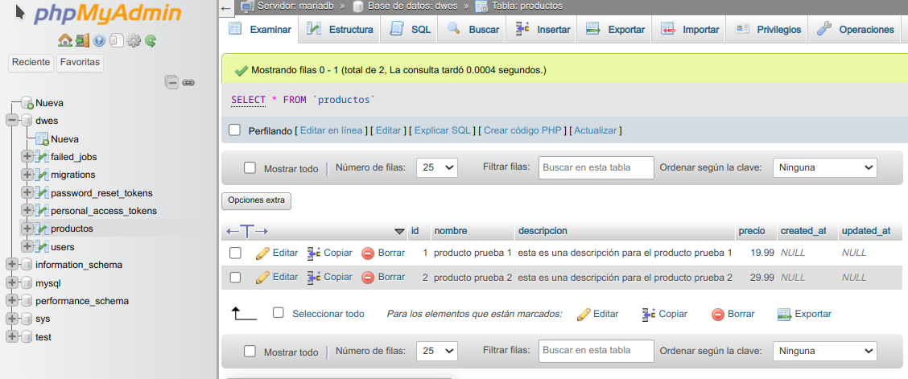
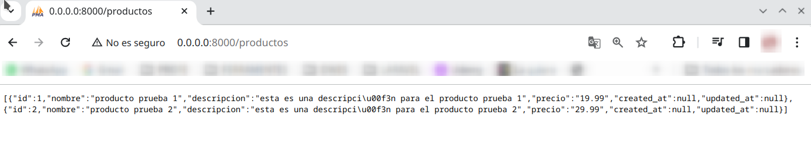
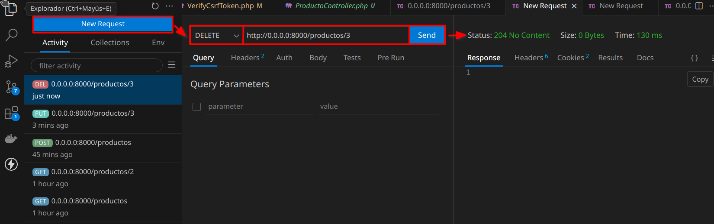

# crear tabla Productos

## crear migración

1. Crear migración para la tabla `productos`:

   ```php
   php artisan make:migration create_productos_table
   # ó
   # sudo docker-compose exec myapp php artisan make:migration create_productos_table
   ```


2. Añadir al fichero generado (en `migrations) el resto de campos que se requieren en la tabla `productos`:

   ```php
   public function up(): void
   {
     Schema::create('productos', function (Blueprint $table) {
       $table->id();
       $table->string('nombre');
       $table->text('descripcion');
       $table->decimal('precio', 8, 2);
       $table->timestamps();
    });
   }
   ```

3. Ejecutar migración:

   ```php
   php artisan migrate
   # ó
   # sudo docker-compose exec myapp php artisan migrate
   ```

   

   

4. Crear un `seeder`:

   Introducimos información en esta tabla nueva, creando un fichero en la carpeta `database/seeders` de nombre `ProductoSeeder.php`:

   ```php
   <?php
     namespace Database\Seeders;
     use Illuminate\Database\Seeder;
     use Illuminate\Support\Facades\DB;
   
     class ProductoSeeder extends Seeder {
         
       public function run() {
         // insertar datos prueba 
         DB::table('productos')->insert([
            'nombre' => 'producto prueba 1',
            'descripcion' => 'esta es una descripción para el producto prueba 1',
            'precio' => 19.99,
         ]);
   
         DB::table('productos')->insert([
            'nombre' => 'producto prueba 2',
            'descripcion' => 'esta es una descripción para el producto prueba 2',
            'precio' => 29.99,
         ]);
       }
   }
   ```

5. Ejecutar el `seeder`:

   ```php
   php artisan db:seed --class=ProductoSeeder
   # ó
   # sudo docker-compose exec myapp php artisan db:seed --class=ProductoSeeder
   ```

   

   

# crear controlador ProductoController

1. Crear desde consola un controlador para la tabla `producto`:

   ```sh
   php artisan make:controller ProductoController
   # ó
   # sudo docker-compose exec myapp php artisan make:controller ProductoController
   ```

   

   

2. Como vamos a conectarnos a un modelo para traer la información de dicho modelo añadimos mediante `use`; además creamos la función `index`:

   ```php
   <?php
   namespace App\Http\Controllers;
   
   use Illuminate\Http\Request;
   use App\Models\Producto; // <-- esta linea
   
   class ProductoController extends Controller
   {
       public function index(){
           return response()->json(Producto::all());
       }
   }
   ```

3. Crear un modelo en la carpeta `Models` de nombre `Producto.php`:

   ```php
   <?php
       namespace App\Models;
   
       use Illuminate\Database\Eloquent\Model;
   
       class Producto extends Model {
   
           protected $fillable = ['nombre', 'descripcion', 'precio'];
       }
   ```

4. Ir a fichero `web.php` (en la carpeta `routes`) y colocar nuestras rutas:

   ```php
   // cargar el recurso del controlador ProductoController
   use App\Http\Controllers\ProductoController
       
   
   Route::prefix('productos')->group(function(){
     Route::get('/',[ProductoController::class, 'index']);
   });
   ```

   

   La función anterior nos devuelve todos los productos. Pero, qué pasa si queremos un producto en cuestión:

5. En `ProductoController.php` añadimos otra función (show) en la que se le pasa por parámateros el `id` :

   ```php
   <?php
   namespace App\Http\Controllers;
   
   use Illuminate\Http\Request;
   use App\Models\Producto; // <-- esta linea
   
   class ProductoController extends Controller
   {
       public function index(){
           return response()->json(Producto::all());
       }
       public function show($id){
           return response()->json(Producto::find($id));
       }
   }
   ```

6. En `web.php` añadimos otra ruta en nuestro grupo:

   ```php
   Route::prefix('productos')->group(function(){
   
       Route::get('/',[ProductoController::class, 'index']);
       Route::get('/{id}',[ProductoController::class, 'show']);
   });
   ```

   

7. Siguiente método, `store`:

   a) en `ProductoController.php`:

   ```php
       public function store(Request $request){
           $producto = Producto::create($request->all());
           return response()->json($producto, 201);
       }
   ```

   b) en `web.php`:

   ```php
   Route::prefix('productos')->group(function(){
   
       Route::get('/',[ProductoController::class, 'index']);
       Route::get('/{id}',[ProductoController::class, 'show']);
   
       Route::post('/',[ProductoController::class, 'store']);
   });
   ```

8. Método `update`:

   a) en `ProductoController.php`:

   ```php
       public function update(Request $request, $id){
           $producto = Producto::findOrFail($id);
           $producto -> update($request->all());
   
           return response()->json($producto, 200);
       }
   ```

   b) en `web.php`:

   ```php
   Route::prefix('productos')->group(function(){
   
       Route::get('/',[ProductoController::class, 'index']);
       Route::get('/{id}',[ProductoController::class, 'show']);
   
       Route::post('/',[ProductoController::class, 'store']);
       Route::put('/{id}',[ProductoController::class, 'update']);
   });
   ```

9. Método `delete`:

   a) en `ProductoController.php`:

   ```php
       public function destroy($id){
           Producto::findOrFail($id)->delete();
   
           return response()->json(null, 204);
       }
   ```

   b) en `web.php`:

   ```php
   Route::prefix('productos')->group(function(){
   
       Route::get('/',[ProductoController::class, 'index']);
       Route::get('/{id}',[ProductoController::class, 'show']);
   
       Route::post('/',[ProductoController::class, 'store']);
       Route::put('/{id}',[ProductoController::class, 'update']);
       Route::delete('/{id}',[ProductoController::class, 'destroy']);
   });
   ```

   

#  cómo funciona la API REST

Para ello vamos a utilizar un software que es una extensión de Visual Studio Code, de nombre `Thunder Client`:


## listar todos los productos


## producto en concreto


## introducir producto nuevo

Si realizamos una nueva petición (new request) con método `post` y pasando (desde `body` y en `json`) un nuevo producto, va a dar un error. 

Esto se debe a que Laravel, por sus métodos de seguridad, necesita un *token* llamado `csrf`. Ya que, ahora mismo, estamos realizando pruebas, vamos a indicarle a Laravel que excluya la URL en cuestión de la verificación.

Para esto, accedemos al fichero `VerifyCsrfToken.php` de la carpeta `app\Http\Middleware`:

```php
<?php
namespace App\Http\Middleware;

use Illuminate\Foundation\Http\Middleware\VerifyCsrfToken as Middleware;

class VerifyCsrfToken extends Middleware
{
    /**
     * The URIs that should be excluded from CSRF verification.
     *
     * @var array<int, string>
     */
    protected $except = [
        "http://0.0.0.0:8000/productos",  // <-- esta excepción
    ];
}
```


## actualizar un producto existente

1. Añadir al fichero `VerifyCsrfToken.php` de la carpeta `app\Http\Middleware` la excepción:

   ```php
   <?php
   namespace App\Http\Middleware;
   
   use Illuminate\Foundation\Http\Middleware\VerifyCsrfToken as Middleware;
   
   class VerifyCsrfToken extends Middleware
   {
       /**
        * The URIs that should be excluded from CSRF verification.
        *
        * @var array<int, string>
        */
       protected $except = [
           "http://0.0.0.0:8000/productos", 
           "http://0.0.0.0:8000/productos/3",  // <-- esta nueva excepción
       ];
   }
   ```

2. Probar en Thunder Client:


## eliminar un producto



