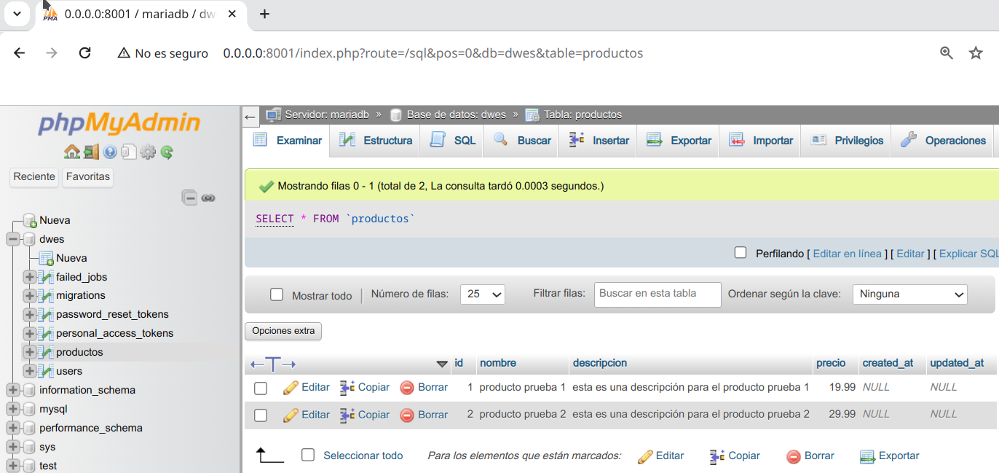

# conceptos de servicios REST

En esta unidad del curso veremos cómo emplear Laravel como proveedor de servicios REST. Comenzaremos detallando algunas cuestiones básicas de la arquitectura cliente-servidor y de los servicios REST, para luego pasar a ver cómo desarrollarlos y probarlos con Laravel.

A estas alturas todos deberíamos tener claro que cualquier aplicación web se basa en una arquitectura cliente-servidor, donde un servidor queda a la espera de conexiones de clientes, y los clientes se conectan a los servidores para solicitar ciertos recursos. Sobre esta base, veremos unas breves pinceladas de cómo funciona el protocolo HTTP, y en qué consisten los servicios REST.

## Conceptos básicos del protocolo HTTP

Las comunicaciones web entre cliente y servidor se realizan mediante el protocolo **HTTP** (o HTTPS, en el caso de comunicaciones seguras). En ambos casos, cliente y servidor se envían cierta información estándar, en cada mensaje

En cuanto a los **clientes**, envían al servidor los datos del recurso que solicitan, junto con cierta información adicional, como por ejemplo las cabeceras de petición (información relativa al tipo de cliente o navegador, contenido que acepta, etc), y parámetros adicionales llamados normalmente *datos del formulario*, puesto que suelen contener la información de algún formulario que se envía de cliente a servidor.

Por lo que respecta a los **servidores**, aceptan estas peticiones, las procesan y envían de vuelta algunos datos relevantes, como un código de estado (indicando si la petición pudo ser atendida satisfactoriamente o no), cabeceras de respuesta (indicando el tipo de contenido enviado, tamaño, idioma, etc), y el recurso solicitado propiamente dicho, si todo ha ido correctamente.

Este es el mecanismo que hemos estado utilizando hasta ahora a través de los controladores: reciben la petición concreta del cliente, y envían una respuesta, que por el momento se ha centrado en renderizar un contenido HTML de una vista.

En cuanto a los **códigos de estado** de la respuesta, depende del resultado de la operación que se haya realizado, éstos se catalogan en cinco grupos:

- *Códigos **1XX***: representan información sobre una petición normalmente incompleta. No son muy habituales, pero se pueden emplear cuando la petición es muy larga, y se envía antes una cabecera para comprobar si se puede procesar dicha petición.
- *Códigos **2xx***: representan peticiones que se han podido atender satisfactoriamente. El código más habitual es el *200*, respuesta estándar para las peticiones que son correctas. Existen otras variantes, como el código *201*, que se envía cuando se ha insertado o creado un nuevo recurso en el servidor (una inserción en una base de datos, por ejemplo), o el código *204*, que indica que la petición se ha atendido bien, pero no se ha devuelto nada como respuesta.
- *Códigos **3xx***: son códigos de redirección, que indican que de algún modo la petición original se ha redirigido a otro recurso del servidor. Por ejemplo, el código *301* indica que el recurso solicitado se ha movido permanentemente a otra URL. El código *304* indica que el recurso solicitado no ha cambiado desde la última vez que se solicitó, por si se quiere recuperar de la caché local en ese caso.
- *Códigos **4xx***: indican un error por parte del cliente. El más típico es el error *404*, que indica que estamos solicitando una URL o recurso que no existe. Pero también hay otros habituales, como el *401* (cliente no autorizado), o *400* (los datos de la petición no son correctos, por ejemplo, porque los campos del formulario no sean válidos).
- *Códigos **5xx***: indican un error por parte del servidor. Por ejemplo, el error *500* indica un error interno del servidor, o el *504*, que es un error de *timeout* por tiempo excesivo en emitir la respuesta.

Haremos uso de estos códigos de estado en nuestros servicios REST para informar al cliente del tipo de error que se haya producido, o del estado en que se ha podido atender su petición.

## Los servicios REST

REST son las siglas de ***RE**presentational **S**tate **T**ransfer*, y designa un estilo de arquitectura de aplicaciones distribuidas basado en HTTP. En un sistema REST, identificamos cada recurso a solicitar con una URI (identificador uniforme de recurso), y definimos un conjunto delimitado de comandos o métodos a realizar, que típicamente son:

- **GET**: para obtener resultados de algún tipo (listados completos o filtrados por alguna condición).
- **POST**: para realizar inserciones o añadir elementos en un conjunto de datos.
- **PUT**: para realizar modificaciones o actualizaciones del conjunto de datos.
- **DELETE**: para realizar borrados del conjunto de datos.
- Existen otros tipos de comandos o métodos, como por ejemplo **PATCH** (similar a PUT, pero para cambios parciales), **HEAD** (para consultar sólo el encabezado de la respuesta obtenida), etc. 

Nos centraremos de momento en los cuatro métodos principales anteriores.

Por lo tanto, identificando el recurso a solicitar y el comando a aplicarle, el servidor que ofrece esta API REST proporciona una respuesta a esa petición. Esta respuesta típicamente viene dada por un mensaje en formato **JSON** o XML (aunque éste último cada vez está más en desuso). Esto permite que las aplicaciones puedan extenderse a distintas plataformas, y acceder a los mismos servicios desde una aplicación Angular, o una aplicación de escritorio .NET, o una aplicación móvil en Android, por poner varios ejemplos.

> **ACLARACIÓN**: para quienes no conozcáis la definición de API (*Application Programming Interface*), básicamente es el conjunto de métodos o funcionalidades que se ponen a disposición de quienes los quieran utilizar. En este caso, el concepto de API REST hace referencia al conjunto de servicios REST proporcionados por el servidor para los clientes que quieran utilizarlos.
>
> Una de las características fundamentales de las API es que son ***Stateless***, lo que quiere decir que las peticiones se hacen y desaparecen, no hay usuarios logueados ni datos que se quedan almacenados.
>
> Ejemplos de APIs gratuitas:
>
> - [ChuckNorris IO](https://api.chucknorris.io/#!)
> - [OMDB](https://www.omdbapi.com/)
> - [PokeAPI - Pokemon](https://pokeapi.co/)
> - [RAWg - Videojuegos](https://rawg.io/)
> - [The Star Wars API](https://swapi.dev/)
>
> Para hacer pruebas con estas APIs podemos implementar el código para consumirlas o utilizar un cliente especial para el consumo de estos servicios.
>
> - [PostMan](https://www.postman.com/)
> - [Thunder Client](https://marketplace.visualstudio.com/items?itemName=rangav.vscode-thunder-client) (*utilizaremos esta extensión de VS Code para nuestras comprobaciones*).
> - [Insomnia](https://insomnia.rest/download)
> - [Advance REST Client (desde el navegador)](https://chrome.google.com/webstore/detail/advanced-rest-client/hgmloofddffdnphfgcellkdfbfbjeloo?hl=es)
>

## El formato JSON

JSON son las siglas de *JavaScript Object Notation*, una sintaxis propia de Javascript para poder representar objetos como cadenas de texto, y poder así serializar y enviar información de objetos a través de flujos de datos (archivos de texto, comunicaciones cliente-servidor, etc).

Un objeto Javascript se define mediante una serie de propiedades y valores. Por ejemplo, los datos de una persona (como nombre y edad) podríamos almacenarlos así:

```php
let persona = {
    nombre: "Nacho",
    edad: 39
};
```

Este mismo objeto, convertido a JSON, formaría una cadena de texto con este contenido:

```php
{"nombre":"Nacho","edad":39}
```

Del mismo modo, si tenemos una colección (vector) de objetos como ésta:

```php
let personas = [
    { nombre: "Nacho", edad: 39},
    { nombre: "Mario", edad: 4},
    { nombre: "Laura", edad: 2},
    { nombre: "Nora", edad: 10}
];
```

Transformada a JSON sigue la misma sintaxis, pero entre corchetes:

```php
[{"nombre":"Nacho","edad":39}, {"nombre":"Mario","edad":4},  
 {"nombre":"Laura","edad":2}, {"nombre":"Nora","edad":10}]
```

Cuando solicitamos un servicio REST, típicamente la respuesta (los datos que nos envía el servicio) vienen en este formato JSON, de modo que es fácilmente serializable y se puede enviar entre cualquier tipo de cliente (móvil, web, escritorio) y el servidor.

# creación de servicios REST

Veamos ahora qué pasos dar para construir una API REST en Laravel que dé soporte a las operaciones básicas sobre una o varias entidades: consultas (GET), inserciones (POST), modificaciones (PUT) y borrados (DELETE). Emplearemos para ello los denominados controladores de API, que comentamos brevemente en unidades anteriores, al hablar de controladores, y que proporcionan un conjunto de funciones ya definidas para dar soporte a cada uno de estos comandos.

## 1. Definiendo los controladores de API

Para proporcionar una API REST a los clientes que lo requieran, necesitamos definir un controlador (o controladores) orientados a ofrecer estos servicios REST. Estos controladores en Laravel se denominan de tipo *api*, como vimos en sesiones previas. Normalmente se definirá un controlador API por cada uno de los modelos a los que necesitemos acceder. Vamos a crear uno de prueba para ofrecer una API REST sobre los libros de nuestra aplicación de biblioteca.

Existen diferentes formas de ejecutar el comando de creación del controlador de API. Aquí vamos a mostrar quizá una de las más útiles:

```php
php artisan make:controller Api/LibroController --api --model=Libro
// ó, si no funciona:
// sudo docker-compose exec myapp php artisan make:controller Api/LibroController --api --model=Libro
```

​	

```php
namespace App\Http\Controllers\Api;

use App\Http\Controllers\Controller;
use App\Models\Libro;
use Illuminate\Http\Request;

class LibroController extends Controller
{
  /**
   * Display a listing of the resource.
   *
   * @return \Illuminate\Http\Response
   */
  public function index()
  {
    //
  }

  /**
   * Store a newly created resource in storage.
   *
   * @param  \Illuminate\Http\Request  $request
   * @return \Illuminate\Http\Response
   */
  public function store(Request $request)
  {
    //
  }

  /**
   * Display the specified resource.
   *
   * @param  \App\Models\Libro  $libro
   * @return \Illuminate\Http\Response
   */
  public function show(Libro $libro)
  {
    //
  }

  /**
   * Update the specified resource in storage.
   *
   * @param  \Illuminate\Http\Request  $request
   * @param  \App\Models\Libro  $libro
   * @return \Illuminate\Http\Response
   */
  public function update(Request $request, Libro $libro)
  {
    //
  }

  /**
   * Remove the specified resource from storage.
   *
   * @param  \App\Models\Libro  $libro
   * @return \Illuminate\Http\Response
   */
  public function destroy(Libro $libro)
  {
    //
  }
}
```

Observemos que se incorpora automáticamente la cláusula `use` para cargar el modelo asociado, que hemos indicado en el parámetro `--model`. Además, los métodos `show`, `update` y `destroy` ya vienen con un parámetro de tipo `Libro` que facilitará mucho algunas tareas.

> **NOTA**: en el caso de versiones anteriores a Laravel 8, hay que tener en cuenta que, por defecto, los modelos se ubican en la carpeta `App`, por lo que deberemos indicar cualquier subcarpeta donde localizar el modelo cuando creemos el controlador, si es que lo hemos movido a una subcarpeta. Por ejemplo, `--model=Models/Libro`.

Cada una de las funciones del nuevo controlador creado se asocia a uno de los métodos REST comentados anteriormente:

- `index` se asociaría con una operación GET de listado general, para obtener todos los registros (de libros, en este caso)
- `store` se asociaría con una operación POST, para almacenar los datos que lleguen en la petición (como un nuevo libro, en nuestro caso)
- `show` se asociaría con una operación GET para obtener el registro asociado a un identificador concreto
- `update` se asociaría con una operación PUT, para actualizar los datos del registro asociado a un identificador concreto
- `destroy` se asociaría con una operación DELETE, para eliminar los datos del registro asociado a un identificador concreto

## 2. Estableciendo las rutas

Una vez tenemos el controlador API creado, vamos a definir las rutas asociadas a cada método del controlador. Si recordamos de sesiones anteriores, podíamos emplear el método `Route::resource` en el archivo `routes/web.php` para establecer de golpe todas las rutas asociadas a un controlador de recursos. De forma análoga, podemos emplear el método `Route::apiResource` en el archivo `routes/api.php` para establecer automáticamente todas las rutas de un controlador de API. Añadimos esta línea en dicho archivo `routes/api.php`:

```php
use App\Http\Controllers\Api\LibroController;
// ...
Route::apiResource('libros', LibroController::class);
```

Las rutas de API (aquellas definidas en el archivo `routes/api.php`) por defecto tienen un prefijo `api`, tal y como se establece en el *provider* `RouteServiceProvider`. Por tanto, hemos definido una ruta general `api/libros`, de forma que todas las subrutas que se deriven de ella llevarán a uno u otro método del controlador de API de libros.

Podemos comprobar **qué rutas hay activas** con este comando:

```php
php artisan route:list
// ó, si no funciona:
// sudo docker-compose exec myapp php artisan route:list
```

Veremos, entre otras, las 5 rutas derivadas del controlador API de libros:

```php
+----------------------------------------------------+
|Method     | URI                   | Name           |
+----------------------------------------------------+
| GET|HEAD  | api/libros            | libros.index   |
| POST      | api/libros            | libros.store   |
| GET|HEAD  | api/libros/{libro}    | libros.show    |
| PUT|PATCH | api/libros/{libro}    | libros.update  |
| DELETE    | api/libros/{libro}    | libros.destroy |
+----------------------------------------------------+
```

## 3. Servicios GET

Vamos a empezar por definir el método `index`. En este caso, vamos a obtener el conjunto de libros de la base de datos y devolverlo tal cual:

```php
public function index()
{
  $libros = Libro::get();
  return $libros;
}
```

Si accedemos a la ruta `api/libros` desde el navegador, se activará el método `index` que acabamos de implementar, y recibiremos los libros de la base de datos, directamente en formato JSON.


> **NOTA**: podemos instalar la extensión [JSON formatter](https://chrome.google.com/webstore/detail/json-formatter/bcjindcccaagfpapjjmafapmmgkkhgoa?hl=es) para Chrome, y así poder ver los datos en formato JSON más organizados y con la sintaxis resaltada, como en la imagen anterior.

De una forma similar, podríamos implementar y probar el método `show`, para mostrar los datos de un libro en particular:

```php
public function show(Libro $libro)
{
  return $libro;
}
```

En este caso, si accedemos a la URI `api/libros/1`, obtendremos la información del libro con *id* = 1. Notar que Laravel se encarga automáticamente de buscar el libro por nosotros (hacer la correspondiente operación `find` para el *id* proporcionado). Es lo que se conoce como *enlace implícito*, y es algo que también está disponible en los controladores web normales, siempre que los asociemos correctamente con el modelo vinculado. Esto se hace automáticamente si creamos el controlador junto con el modelo, como vimos en la unidad 4, o si usamos el parámetro `--model` para asociarlo, como hemos hecho aquí.

### 3.1. Más sobre el formato JSON y la respuesta

Tras probar los dos servicios anteriores, habrás observado que Laravel se encarga de transformar directamente los registros obtenidos a formato JSON cuando los enviamos mediante `return`, por lo que, en principio, no tenemos por qué preocuparnos de este proceso. Sin embargo, de este modo se escapan algunas cosas a nuestro control. Por ejemplo, y sobre todo, no podemos especificar el código de estado de la respuesta, que por defecto es 200 si todo ha ido correctamente. Además, tampoco podemos controlar qué información enviar del objeto en cuestión.

Si queremos limitar o formatear la información a enviar de los objetos que estamos tratando, y que no se envíen todos sus campos sin más, tenemos varias opciones:

- Añadir cláusulas `hidden` en los modelos correspondientes, para indicar que esa información no debe ser enviada en ningún caso en ninguna parte de la aplicación. Es lo que ocurre, por ejemplo, con el campo *password* del modelo de `Usuario`:

```php
protected $hidden = ['password'];
```

- Definir a mano un array con los campos a enviar en el método del controlador. En el caso de la ficha del libro anterior, si sólo queremos enviar el título y la editorial, podríamos hacer algo así:

```php
public function show(Libro $libro)
{
  return [
     'titulo'    => $libro->titulo,
     'editorial' => $libro->editorial
  ];
}
```

- En el caso de que el paso anterior sea muy costoso (porque el modelo tenga muchos campos, o porque tengamos que hacer lo mismo en varias partes del código), también podemos definir recursos (*resources*), que permiten separar el código de la información a mostrar del propio controlador. [Aquí](https://laravel.com/docs/eloquent-resources) podéis encontrar información al respecto, ya que estos contenidos escapan del alcance de esta sesión.

Por otra parte, si queremos añadir o modificar más información en la respuesta, como el código de estado, la estructura anterior no nos sirve, ya que siempre se va a enviar un código 200. Para esto, es conveniente emplear el método `response()->json(...)`, que permite especificar como primer parámetro los datos a enviar, y como segundo parámetro el código de estado. Los métodos anteriores quedarían así, enviando un código 200 como respuesta (aunque si se omite el segundo parámetro, se asume que es 200):

```php
public function index()
{
  $libros = Libro::get();
  return response()->json($libros, 200);;
}
// ...
public function show(Libro $libro)
{
  return response()->json($libro, 200);
}
```

## 4. Resto de servicios

Veamos ahora cómo implementar el resto de servicios (POST, PUT y DELETE). En el caso de la inserción (**POST**), deberemos recibir en la petición los datos del objeto a insertar (un libro, en nuestro ejemplo). Igual que los datos del servidor al cliente se envían en formato JSON, es de esperar en aplicaciones que siguen la arquitectura REST que los datos del cliente al servidor también se envíen en formato JSON.

Nuestro método `store`, asociado al servicio POST, podría quedar de este modo (devolvemos el código de estado 201, que se utiliza cuando se han insertado elementos nuevos):

```php
public function store(Request $request)
{
  $libro = new Libro();
  $libro->titulo = $request->titulo;
  $libro->editorial = $request->editorial;
  $libro->precio = $request->precio;
  $libro->autor()->associate(Autor::findOrFail($request->autor_id));
  $libro->save();

  return response()->json($libro, 201);
}
```

De forma similar implementaríamos el servicio **PUT**, a través del método `update`. En este caso devolvemos un código de estado 200:

```php
public function update(Request $request, Libro $libro)
{
  $libro->titulo = $request->titulo;
  $libro->editorial = $request->editorial;
  $libro->precio = $request->precio;
  $libro->autor()->associate(Autor::findOrFail($request->autor_id));
  $libro->save();

  return response()->json($libro);
}
```

Finalmente, para el servicio **DELETE**, debemos implementar el método `destroy`, que podría quedar así:

```php
public function destroy(Libro $libro)
{
  $libro->delete();
  return response()->json(null, 204);
}
```

Notar que devolvemos un código de estado 204, que indica que no estamos devolviendo contenido (es *null*). Por otra parte, es habitual en este tipo de operaciones de borrado devolver en formato JSON el objeto que se ha eliminado, por si acaso se quiere deshacer la operación en un paso posterior. En este caso, el código del método de borrado sería así:

```php
public function destroy(Libro $libro)
{
  $libro->delete();
  return response()->json($libro);
}
```

Como podemos empezar a intuir, probar estos servicios no es tan sencillo como probar servicios de tipo GET, ya que no podemos simplemente teclear una URL en el navegador. Necesitamos un mecanismo para pasarle los datos al servidor en formato JSON, y también el método (POST, PUT o DELETE). Veremos cómo en la siguiente sección.

### 4.1. Validación de datos

A la hora de recibir datos en formato JSON para servicios REST, también podemos establecer mecanismos de **validación** similares a los vistos para los formularios, a través de los correspondientes *requests*. De hecho, en el caso de la biblioteca podemos emplear la clase `App\Http\Requests\LibroPost` que hicimos en sesiones anteriores, para validar que los datos que llegan tanto a `store` como a `update` son correctos. Basta con usar un parámetro de este tipo en estos métodos, en lugar del parámetro `Request` que viene por defecto:

```php
public function store(LibroPost $request)
{
  // ...
}
...
public function update(LibroPost $request, Libro $libro)
{
  // ...
}
```

### 4.2. Respuestas de error

Por otra parte, debemos asegurarnos de que cualquier error que se produzca en la parte de la API devuelva un cotenido en formato JSON, y no una página web. Por ejemplo, si solicitamos ver la ficha de un libro cuyo *id* no existe, no debería devolvernos una página de error 404, sino un código de estado 404 con un mensaje de error en formato JSON.

Esto no se cumple por defecto, ya que Laravel está configurado para renderizar una vista con el error producido. Para modificar este comportamiento en **versiones anteriores a Laravel 8**, debemos editar el archivo `App\Exceptions\Handler.php`, en concreto su método `render`, y hacer algo así:

```php
public function render($request, Throwable $exception)
{
  if ($request->is('api*'))
  {
    if ($exception instanceof ModelNotFoundException)
      return response()->json(['error' => 'Elemento no encontrado'], 404);
    else if ($exception instanceof ValidationException)
      return response()->json(['error' => 'Datos no válidos'], 400);
    else if (isset($exception))
      return response()->json(['error' => 'Error en la aplicación: ' . 
                $exception->getMessage()], 500);
  }

  // Esta es la única instrucción que hay en la versión original
  return parent::render($request, $exception);
}
```

Hemos añadido sobre el código original una cláusula `if` que se centra en las peticiones de tipo `api`. En este caso, podemos distinguir los distintos tipos de excepciones que se producen. Para nuestro ejemplo distinguimos tres: errores de tipo 404, errores de validación u otros errores. En todos los casos se devuelve un contenido JSON con el código de estado y campos adecuados. Si todo es correcto y no hay errores, o si no estamos en rutas *api*, el comportamiento será el habitual.

En el caso de **Laravel 8 y posteriores**, el método a modificar se llama `register`, dentro de la misma clase `App\Exceptions\Handler.php`. Lo podemos dejar de este modo para hacer algo equivalente a lo anterior:

```php
public function register()
{
  $this->renderable(function (Throwable $exception) {
     if (request()->is('api*'))
     {
        if ($exception instanceof ModelNotFoundException)
            return response()->json(['error' => 'Recurso no encontrado'], 404);
        else if ($exception instanceof ValidationException)
            return response()->json(['error' => 'Datos no válidos'], 400);
        else if (isset($exception))
            return response()->json(['error' => 'Error: ' . 
                    $exception->getMessage()], 500);
     }
  });
}
```

> **NOTA**: relacionado con el código anterior, las excepciones que se identifican están en `Illuminate\Database\Eloquent\ModelNotFoundException` e `Illuminate\Validation\ValidationException`, respectivamente.

En algunas versiones de Laravel, la clase base `ExceptionHandler` realiza algunas conversiones de tipos de excepciones. Así, por ejemplo, la excepción `ModelNotFoundException` se convierte a `NotFoundHttpException`. En este caso, el `if` anterior que detecta la excepción podría no funcionar, ya que el operador `instanceof` está buscando la excepción equivocada. Una forma algo más completa de detectar si no se encuentra el recurso solicitado sería esta (incluimos las cláusulas `using` correspondientes también):

```php
namespace App\Exceptions;

use Illuminate\Foundation\Exceptions\Handler as ExceptionHandler;
use Symfony\Component\HttpKernel\Exception\NotFoundHttpException;
use Illuminate\Validation\ValidationException;
use Illuminate\Database\Eloquent\ModelNotFoundException;
use Throwable;

class Handler extends ExceptionHandler
{
  // ...

  public function register()
  {
    $this->renderable(function (Throwable $exception) {
       if (request()->is('api*'))
       {
          if ($exception instanceof ModelNotFoundException ||
             ($exception instanceof NotFoundHttpException && 
               $exception->getPrevious() &&
               $exception->getPrevious() instanceof ModelNotFoundException))
            return response()->json(['error' => 'Recurso no encontrado'], 404);
          else if ($exception instanceof ValidationException)
            return response()->json(['error' => 'Datos no válidos'], 400);
          else if (isset($exception))
            return response()->json(['error' => 'Error: ' .
                        $exception->getMessage()], 500);
       }
    });
  }
```

De este modo, detectamos tanto si es una `ModelNotFoundException` original como si ha sido convertida a `NotFoundHttpException`.

# ejemplo API Rest en tabla productos

## crear tabla productos

Antes de crear nuestra API en tabla `Productos` deberemos tener dicha tabla migrada en nuestro sistema. Para ello:

1. Crear **migración** para la tabla `productos`:

   > Recuerda que el nombre de la migración contiene palabras reservadas para como son *create* y *table*.

   ```php
   php artisan make:migration create_productos_table
   # ó, si no funciona, probar:
   # sudo docker-compose exec myapp php artisan make:migration create_productos_table
   ```


2. Añadir al fichero generado (en la carpeta `migrations` y en el ejemplo anterior *2024_01_08_102832_create_productos_table.php*) el resto de campos que se requieran en la tabla `productos`:

```php
public function up(): void
{
  Schema::create('productos', function (Blueprint $table) {
    $table->id();
    $table->string('nombre');
    $table->text('descripcion');
    $table->decimal('precio', 8, 2);
    $table->timestamps();
 });
}
```

2. Ejecutar migración:

   ```php
   php artisan migrate
   # ó, si no funciona, probar:
   # sudo docker-compose exec myapp php artisan migrate
   ```

   

   

3. Crear un `seeder` para realizar una carga de datos:

   Introducimos información en esta tabla nueva, creando un fichero en la carpeta `database/seeders` de nombre `ProductoSeeder.php`:

   ```php
   <?php
     namespace Database\Seeders;
     use Illuminate\Database\Seeder;
     use Illuminate\Support\Facades\DB;
   
     class ProductoSeeder extends Seeder {
         
       public function run() {
         // insertar datos prueba 
         DB::table('productos')->insert([
            'nombre' => 'producto prueba 1',
            'descripcion' => 'esta es una descripción para el producto prueba 1',
            'precio' => 19.99,
         ]);
   
         DB::table('productos')->insert([
            'nombre' => 'producto prueba 2',
            'descripcion' => 'esta es una descripción para el producto prueba 2',
            'precio' => 29.99,
         ]);
       }
   }
   ```

4. Ejecutar el `seeder`:

   ```php
   php artisan db:seed --class=ProductoSeeder
   # ó, si no funciona, probar:
   # sudo docker-compose exec myapp php artisan db:seed --class=ProductoSeeder
   ```

   

   

## crear controlador ProductoController

Crear un controlador donde establezcamos los métodos que nosotros queramos realizar a la hora de trabajar con los datos.

1. **Crear** desde consola un controlador para la tabla `productos`:

   ```sh
   php artisan make:controller ProductoController
   # ó, si no funciona, probar:
   # sudo docker-compose exec myapp php artisan make:controller ProductoController
   ```

   

   

   La estructura de este archivo es un poco diferente a los controladores que ya hemos visto anteriormente. Ahora tenemos los siguientes métodos creados de manera automática:

   - `index()` normalmente para listar (en nuestro caso los chollos).
   - `create()` para crear plantillas (no lo vamos a usar).
   - `store()` para guardar los datos que pasemos a la API.
   - `update()` para actualizar un dato ya existente en la BD.
   - `delete()` para eliminar un dato ya existente en la BD.

2. Como vamos a conectarnos a un modelo para traer la información de dicho modelo añadimos mediante `use`. También creamos la función `index` para listar todos los elementos de la tabla (en este caso `productos`):

   ```php
   <?php
   namespace App\Http\Controllers;
   
   use Illuminate\Http\Request;
   use App\Models\Producto; // <-- esta linea
   
   class ProductoController extends Controller
   {
       public function index(){
           return response()->json(Producto::all());
       }
   }
   ```

   > **CUIDADO CON EL RETURN** porque ahora no estamos devolviendo una vista sino un array de datos en formato JSON.

3. Crear un modelo en la carpeta `Models` de nombre `Producto.php`:

   ```php
   <?php
       namespace App\Models;
   
       use Illuminate\Database\Eloquent\Model;
   
       class Producto extends Model {
           protected $fillable = ['nombre', 'descripcion', 'precio'];
       }
   ```

4. Ir a fichero `web.php` (en la carpeta `routes`) y colocar nuestras rutas:

   ```php
   // cargar el recurso del controlador ProductoController
   use App\Http\Controllers\ProductoController
       
   
   Route::prefix('productos')->group(function(){
     Route::get('/',[ProductoController::class, 'index']);
   });
   ```

   

   La función anterior `index` nos devuelve todos los productos. Pero, qué pasa si queremos un producto en cuestión:

5. En `ProductoController.php` añadimos otra función (show) en la que se le pasa por parámateros el `id` :

   ```php
   <?php
   namespace App\Http\Controllers;
   
   use Illuminate\Http\Request;
   use App\Models\Producto; // <-- esta linea
   
   class ProductoController extends Controller
   {
       public function index(){
           return response()->json(Producto::all());
       }
       public function show($id){
           return response()->json(Producto::find($id));
       }
   }
   ```

6. En `web.php` añadimos otra ruta en nuestro grupo:

   ```php
   Route::prefix('productos')->group(function(){
       Route::get('/',[ProductoController::class, 'index']);
       Route::get('/{id}',[ProductoController::class, 'show']);
   });
   ```

   

7. Para introducir datos utilizaremos el método `store`:

   a) en `ProductoController.php`:

   ```php
       public function store(Request $request){
           $producto = Producto::create($request->all());
           return response()->json($producto, 201);
       }
   ```

   b) en `web.php`:

   ```php
   Route::prefix('productos')->group(function(){
       Route::get('/',[ProductoController::class, 'index']);
       Route::get('/{id}',[ProductoController::class, 'show']);
       Route::post('/',[ProductoController::class, 'store']);
   });
   ```

8. Para actualizar datos de un producto, utilizaremos el método `update`:

   a) en `ProductoController.php`:

   ```php
       public function update(Request $request, $id){
           $producto = Producto::findOrFail($id);
           $producto -> update($request->all());
   
           return response()->json($producto, 200);
       }
   ```

   

   

   

   

   

   b) en `web.php`:

   ```php
   Route::prefix('productos')->group(function(){
       Route::get('/',[ProductoController::class, 'index']);
       Route::get('/{id}',[ProductoController::class, 'show']);
       Route::post('/',[ProductoController::class, 'store']);
       Route::put('/{id}',[ProductoController::class, 'update']);
   });
   ```

9. Y para eliminar un producto, el método `delete`:

   a) en `ProductoController.php`:

   ```php
       public function destroy($id){
           Producto::findOrFail($id)->delete();
   
           return response()->json(null, 204);
       }
   ```

   b) en `web.php`:

   ```php
   Route::prefix('productos')->group(function(){
       Route::get('/',[ProductoController::class, 'index']);
       Route::get('/{id}',[ProductoController::class, 'show']);
       Route::post('/',[ProductoController::class, 'store']);
       Route::put('/{id}',[ProductoController::class, 'update']);
       Route::delete('/{id}',[ProductoController::class, 'destroy']);
   });
   ```


## cómo funciona la API REST

Para ello vamos a utilizar un software que es una extensión de Visual Studio Code, de nombre `Thunder Client`:


### listar todos los productos


### listar un producto en concreto


### introducir producto nuevo

> Si realizamos una nueva petición (new request) con método `post` y pasando (desde `body` y en `json`) un nuevo producto, va a mostrarnos un **error**. 
>
> Esto se debe a que Laravel, por sus métodos de seguridad, necesita un *token* llamado `csrf`. 
>
> Ya que, ahora mismo, estamos realizando pruebas, vamos a indicarle a Laravel que excluya la URL en cuestión de la verificación.
>
> Para ello accedemos al fichero `VerifyCsrfToken.php` de la carpeta `app\Http\Middleware`:
>
> ```php
> <?php
> namespace App\Http\Middleware;
> 
> use Illuminate\Foundation\Http\Middleware\VerifyCsrfToken as Middleware;
> 
> class VerifyCsrfToken extends Middleware
> {
>  /**
>      * The URIs that should be excluded from CSRF verification.
>      *
>      * @var array<int, string>
>      */
>     protected $except = [
>         "http://0.0.0.0:8000/productos",  // <-- esta excepción
>     ];
> }
> ```


### actualizar un producto existente

> Recuerda añadir al fichero `VerifyCsrfToken.php` de la carpeta `app\Http\Middleware` la excepción:
>
> ```php
> <?php
> 	// [..]
>  protected $except = [
>      "http://0.0.0.0:8000/productos", 
>      "http://0.0.0.0:8000/productos/3",  // <-- esta nueva excepción
>  ];
> }
> ```


### eliminar un producto





# ejercicios propuestos

## Ejercicio 1

Sobre el proyecto **blog** de la sesión anterior, vamos a añadir estos cambios:

- Crea un controlador de tipo api llamado `PostController` en la carpeta `App\Http\Controllers\Api`, asociado al modelo `Post` que ya tenemos de sesiones previas. Rellena los métodos `index`, `show`, `store`, `update` y `destroy` para que, respectivamente, hagan lo siguiente:
   - `index` deberá devolver en formato JSON el listado de todos los posts, con un código 200
   - `show` deberá devolver la información del post que recibe, con un código 200
   - `store` deberá insertar un nuevo post con los datos recibidos, con un código 201, y utilizando el validador de posts que hiciste en la sesión 6. Para el usuario creador del post, pásale como parámetro JSON un usuario cualquiera de la base de datos.
   - `update` deberá modificar los campos del post recibidos, con un código 200, y empleando también el validador de posts que hiciste en la sesión 6.
   - `destroy` deberá eliminar el post recibido, devolviendo *null* con un código 204
- Crea una colección en *Thunder Client* llamada `Blog` que defina una petición para cada uno de los cinco servicios implementados. Comprueba que funcionan correctamente y exporta la colección a un archivo.

**¿Qué entregar?**

Como entrega de esta sesión deberás comprimir el proyecto **blog** con los cambios incorporados, y eliminando las carpetas `vendor` y `node_modules` como se explicó en las sesiones anteriores. Añade dentro también la colección *Thunder Client* para probar los servicios. Renombra el archivo comprimido a `blog_08.zip`.


# bibliografia

- [Nacho Iborra Baeza](https://nachoiborraies.github.io/laravel/).****
